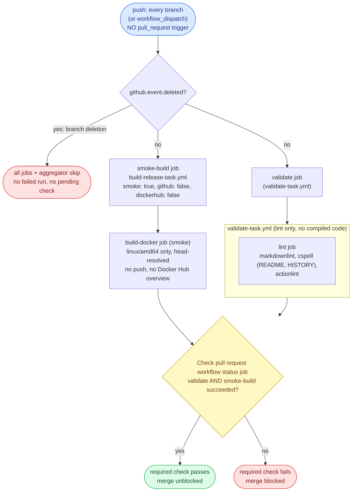
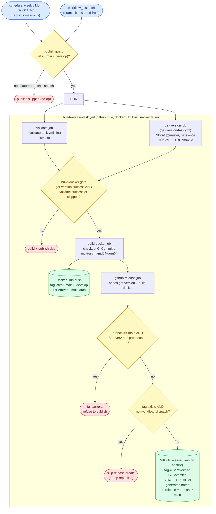
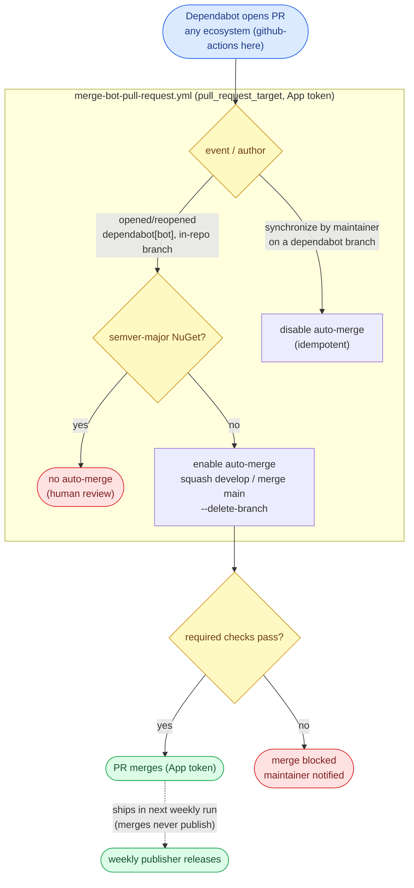

# WORKFLOW.md

The single guide for this repo's CI/CD **workflows** (GitHub Actions): **code style**, **architecture**, a
**behavioral contract** (expected inputs and outputs), and a **test methodology**. Source style lives in
[`CODESTYLE.md`](./CODESTYLE.md). This file covers everything under
[`.github/workflows/`](./.github/workflows/).

It **describes required outcomes, not a required implementation.** A workflow is correct when it satisfies
the contract (section 4), whatever shape its YAML takes. Section 2 keeps workflows legible. Section 3 is
the model. Section 4 is what they must *do*. Sections 5 and 6 are how to verify it and the configuration it
assumes. Each guarantee names the **failure it prevents**, so the reason survives a reimplementation.

## 0. The model at a glance

VSCode-Server-DotNetCore ships **one target**: a **multi-arch Docker image** (Docker Hub) that layers the
.NET LTS+STS SDKs onto the LinuxServer.io code-server base. There is no compiled code in this repo - the
Dockerfile is the only build input. Two workflows do the work:

- **CI** runs on **push to every branch**: it validates (lint) and smoke-builds the image, publishing
  nothing. A pull request merges only when its required check is green.
- **The publisher** runs on a **weekly schedule and on manual dispatch** - never on a merge, and builds **one
  branch per run** (the trigger ref). The **schedule** rebuilds **`main` only** (stable release + refreshed
  `latest` image, picking up base-image CVEs). A **dispatch** publishes the branch it is started from: from
  `main` -> stable / `latest`, from `develop` -> prerelease / `develop`. Merges accumulate; the next scheduled
  run ships main's, and a develop release is cut by dispatching from `develop`.

There is no publish-on-merge, no per-push release, and no two-branch matrix - building only the trigger branch
keeps `github.ref` aligned with the branch being versioned. A maintainer dispatches to release on demand.
Dependabot pull requests merge themselves once their checks pass.

### Glossary

- **Entry workflow** - has `push` / `schedule` / `workflow_dispatch` triggers. The orchestrator that an event or
  a person starts.
- **Reusable workflow (task)** - a `workflow_call` workflow invoked through a `uses:` reference, never
  triggered directly. File ends in `-task.yml`.
- **Target** - the one shipped output: the **Docker image** (`build-docker-task.yml`).
  `build-release-task.yml` orchestrates it plus the GitHub release.
- **Smoke build** - a CI build that builds the image to prove it still ships, publishing and pushing nothing.
  Driven by a `smoke: true` input.
- **Version-anchor release** - the GitHub release carries no build artifact: the image itself ships to Docker
  Hub. The release tags the built commit and attaches the in-tree `LICENSE` + `README.md`, so the tag is
  browsable and the version is recorded. *(There is no `release-asset` artifact seam - nothing is attached
  from a build job.)*
- **Shipped input** - a file that changes what is shipped: the Docker build context (`Dockerfile`, the only
  build input) or the version floor (`version.json`). GitHub-Actions bumps are **not** shipped inputs - they
  ship in the next weekly publish, not on merge.
- **GitHub App token** - a short-lived installation token from `actions/create-github-app-token`, minted
  from the App credentials (`CODEGEN_APP_CLIENT_ID` / `CODEGEN_APP_PRIVATE_KEY`). The merge-bot uses it, not
  `GITHUB_TOKEN`: a `GITHUB_TOKEN` push does not trigger downstream workflows, and that token is read-only on
  Dependabot pull requests.

## 1. Purpose and how to use this document

- **Contract, not implementation.** Conform to the *outcomes* in section 4 and the *architecture* in section
  3. Job names and file layout may vary; the input/output behavior may not.
- **"Operational" - the one definition.** The repo is **operational** when every applicable section-4
  guarantee holds, every applicable section-5B scenario's observed output equals its expected output
  (corroborated by a 5C live probe where a live signal exists), and the section-6 configuration is in place.
  Anything else is **not operational**.
- **Defect vs N/A.** An item is **N/A** only when this repo has no such concern (e.g. a fork-PR scenario,
  since a fork cannot push here; or a build artifact, since nothing is attached to the release). A construct
  required by an applicable guarantee but absent is a **defect**.
- **Default branch is `main`.** Guarantees say "default branch" portably. This repo writes the literal `main`
  in the prerelease expression and the release-version backstop, and the anchored `^refs/heads/main$` in
  `version.json`'s `publicReleaseRefSpec`.

## 2. Workflow style conventions

Legibility rules. Necessary but not sufficient: a perfectly styled workflow can still violate section 4.

- **Action pinning.** Pin every action to a commit SHA with a trailing `# vX.Y.Z` comment. Use `# vX` only
  when the upstream floating major tag has no specific patch SHA. A tool an action *installs* (e.g. the
  actionlint binary behind `raven-actions/actionlint`) is not a `uses:` ref and is left unpinned to track latest.
- **Filename.** Reusable workflows end in `-task.yml`; entry workflows end in what they do
  (`-pull-request.yml`, `-release.yml`). A `-task.yml` is `uses:`-d, never triggered directly.
- **Workflow `name:`.** Reusable names end in **"task"**, entry names in **"action"**.
- **Job and step `name:`.** Every job `name:` ends in **"job"**, every step `name:` in **"step"**, the
  aggregator included (`Check pull request workflow status job`). A job name also bound as a ruleset
  required-check `context:` is codified in [`repo-config/`](./repo-config/) and changed only **in lockstep**
  with the live ruleset.
- **Concurrency.** Every entry workflow declares a `concurrency` group. CI uses
  `group: '${{ github.workflow }}-${{ github.ref }}'`, `cancel-in-progress: true`. The publisher overrides
  it: a ref-independent group with `cancel-in-progress: false`, so two publishes never overlap (a schedule and
  a manual dispatch, or back-to-back dispatches) and none is cancelled mid-release. The merge-bot keys on the PR number with `cancel-in-progress: false` so each PR's events run to completion in order.
- **Shells.** Every multi-line bash `run:` starts with `set -euo pipefail`.
- **Conditionals.** Multi-line `if:` uses the folded scalar `if: >-`.
- **Boolean inputs.** A boolean used by both `workflow_call` and `workflow_dispatch` is declared in both
  trigger blocks and compared against `true` and `'true'`.
- **Reusable-workflow permissions.** Job-level `permissions:` are validated before `if:`, so even a skipped
  job needs valid permissions. Grant least privilege; a callee's extra scope is granted by the caller.
- **Allowlist `success` and `skipped` explicitly** across an optional dependency: use
  `(needs.X.result == 'success' || needs.X.result == 'skipped')`, not `!= 'failure'`.
- **Line endings.** Workflow YAML follows [`.editorconfig`](./.editorconfig) (CRLF). Preserve on every edit.

## 3. Architecture

### Two workflows: CI on push, publishing on schedule/dispatch

CI ([`test-pull-request.yml`](./.github/workflows/test-pull-request.yml)) and the publisher
([`publish-release.yml`](./.github/workflows/publish-release.yml)) are separate workflows with separate
concurrency, so they never race. CI re-tests every pushed tree and never publishes; the publisher releases
on its own cadence and never runs on push. *Prevents a merge from silently cutting a release, and a CI run
from racing a publish on the same ref.*

### The publisher builds one branch: the trigger ref

A publish builds exactly **one** branch - the run's trigger ref. The **schedule** always runs on the default
branch, so it rebuilds `main`; a **dispatch** runs on the branch it is started from (`main` or `develop`). The
single `publish` job passes `github.ref_name` as both `ref` and `branch`, so the branch built, versioned, and
tagged is always the run's own ref. *No matrix and no cross-branch ref mixing - `github.ref` is the branch
being published.* The job is guarded to the long-lived branches (`main` / `develop`); a stray dispatch from a
feature branch is a no-op. To release `develop`, dispatch the workflow from `develop`.

Because the run's ref **is** the built branch, GitHub resolves the local `uses: ./...` reusable workflows from
that same branch's commit - so a `develop` dispatch runs develop's own task definitions, and the schedule runs
main's. There is no definition-vs-content split to reason about.

### Versioning: compute once, thread everywhere

NBGV runs once (in `get-version-task`), classifying from `github.ref` (see below), and its outputs (`SemVer2`,
`GitCommitId`) thread to every consumer via `outputs:` / `needs:`. The Docker build checks out a specific
commit to build it, but consumes the threaded version. `main` (the public ref,
`publicReleaseRefSpec = ^refs/heads/main$`) builds a clean `X.Y.<height>`; every other branch a prerelease
`X.Y.<height>-g<sha>`. *Keeps the built image's version label and the release tag in agreement.* NBGV needs
only `version.json` and git history, so it works although the repo builds no .NET assembly.

NBGV classifies `publicReleaseRefSpec` from the `GITHUB_REF` environment variable. Because the publisher builds
the **trigger ref** (one branch per run), `GITHUB_REF` already equals the branch being versioned - a schedule
or `main` dispatch classifies as public (clean `X.Y.<height>`), a `develop` dispatch as prerelease
(`X.Y.<height>-g<sha>`) - so no `GITHUB_REF` override is needed. (`GITHUB_REF` is reserved and cannot be
reliably overridden anyway; the matrix publishers that build a non-trigger branch are the ones that need
`IGNORE_GITHUB_REF`.) The main-version backstop (D2.2) catches any misclassification.

### Validate at entry

A run that carries a cross-input invariant (e.g. `main` must not carry a prerelease suffix) asserts it once
with `::error::` before any publish. Downstream jobs `needs:` it.

### Fast CI feedback, head-resolved

CI runs on push to every branch, so GitHub head-resolves the reusable `./...` workflows from the pushed head:
a pull request that edits a reusable task tests its own copy. CI validates (the reusable `validate-task`:
`lint` only - there is no compiled code) and smoke-builds the image, pushing nothing. One aggregator job, the
ruleset-bound required check, gates the merge. A branch-deletion push (all-zeros `github.sha`) is skipped by a
`!github.event.deleted` guard on every job, so a deletion never runs a failing build. The publisher runs the
**same** `validate-task` against the branch it publishes (the run's ref is that branch), so the CI gate and the
publish gate are the identical definition applied to the same tree.

### The single-target release

`build-release-task` versions once, builds the Docker image, and creates the GitHub release. The Docker target
pushes multi-arch tags straight to Docker Hub (`latest` for main, `develop` for develop, plus `:SemVer2`). The
GitHub release is a **version anchor**: it tags the built commit and attaches the in-tree `LICENSE` +
`README.md` (no build artifact - the image ships to Docker Hub, not the release). The Docker Hub repository
overview (the root [`README.md`](./README.md)) is pushed on a `main` Docker publish, since Docker Hub does not
read the GitHub README.

### Resource lifecycle

No job uploads or downloads a workflow artifact: the image ships to Docker Hub and the release attaches files
straight from the checkout. There is therefore no artifact retention or cleanup to manage. *(If a future
target adds a transfer artifact, it MUST set `retention-days: 1` and never blanket-delete the run's set.)*

### Self-sufficiency: automatic updates

Every Dependabot pull request auto-merges once the required checks pass (the checks are the safety net),
except a **semver-major NuGet** bump, which waits for human review - this repo has no NuGet ecosystem, so in
practice every bump auto-merges; the guard is retained for convergence with the sibling repos. A merged bump
does not itself publish - it ships in the next weekly publish. There is no codegen and no upstream-version
tracker. A person steps in only for a breaking change (a red check) or to dispatch a release.

### Flow diagrams

Three diagrams trace the architecture above: the pull-request gate, the scheduled/dispatched publisher, and
the bot automation. They depict the same outcomes that the section 4 contract specifies, drawn from the workflow YAML; if a
diagram and a guarantee disagree, one of them is a defect. Triggers are blue, gates yellow,
durable/published outputs green, and stop/skip outcomes red.

**Pull request (CI) - `test-pull-request.yml`.** Every push (no `pull_request` trigger) head-resolves the
reusable tasks, runs the lint validate gate and a non-publishing amd64 Docker smoke build, and a single
aggregator produces the ruleset-bound required check (D1, D6).

**Publish - `publish-release.yml` -> `build-release-task.yml`.** There is NO push trigger and merges never
publish: the publisher runs only on the weekly `schedule` (rebuilding `main` for base-image CVEs) or a
`workflow_dispatch`. It runs the same lint validate gate, versions once with NBGV, backstops the main
version, builds and pushes the multi-arch image to Docker Hub, then cuts the version-anchor GitHub release
(D2, D3, D4).

**Automation - Dependabot + merge-bot.** There is no codegen. Dependabot opens in-repo bot PRs; the merge-bot
(`pull_request_target`, App token) enables auto-merge on open and disables it on a maintainer push. A merged
bump does NOT publish on merge; it ships in the next weekly publisher run above (D8).

## 4. Behavioral contract - expected outcomes

Each is a **MUST**, stated as input -> output plus the failure it prevents.

### D0 - Architecture

- **D0.1 CI is one run, one branch.** Input: any push. Output: `test-pull-request` builds/validates exactly
  `github.ref_name` and publishes nothing. *Prevents cross-branch ref mixing in CI.*
- **D0.2 The publisher builds one branch: the trigger ref.** Output: the `publish` job passes
  `github.ref_name` as `ref` and `branch`, so it checks out, versions, and tags exactly the run's own branch
  (the schedule's default branch, or a dispatch's branch). No matrix; the job is guarded to `main`/`develop`.
  *Prevents cross-branch ref mixing - `github.ref` is the branch being published.*
- **D0.3 One version, threaded.** Output: NBGV runs once, every consumer reads it via `needs:` outputs; no
  consumer recomputes it. *Allowed:* checking out a specific commit to build it, and recording the built
  commit as the release `target_commitish`. *Prevents the image's version diverging from its tag.*

### D1 - CI fast feedback

- **D1.1 Every push validates and smoke-builds the image.** Output: on any push, the `validate` job (the
  reusable `validate-task`) and `smoke-build` (the Docker target through `build-release-task` with
  `smoke: true`) run, no paths filter. *Prevents a reusable-workflow or build break shipping untested.*
- **D1.2 Smoke builds the image.** Output: `smoke-build` builds the Docker image (amd64 only, seeded from the
  branch-scoped cache) to prove it still builds; there is no unit-test job (no compiled code to test).
- **D1.3 Lint enforces the editor checks in CI.** Output: `validate-task`'s `lint` job runs `markdownlint-cli2`,
  `cspell` on the user-facing docs (README, HISTORY), and `actionlint` (which shellchecks every `run:`). Same
  checks the editor runs. There is no CSharpier / `dotnet format` step - nothing compiles.
- **D1.4 Smoke never publishes and never pushes.** Output: a smoke build builds the image but makes no GitHub
  release, no Docker push, no Docker Hub overview update; every publish step is gated `!smoke` (or `push`). Smoke
  still logs in to Docker Hub for higher pull/cache-read rate limits, so it does need the Docker Hub secrets (in
  both the Actions and Dependabot stores); fork-safety rests on a fork being unable to push here, not on
  withholding the login.
- **D1.5 One required aggregator gates merge.** Output: a single aggregator job must **succeed** (not merely
  "not fail"), `needs:` `validate` and `smoke-build`, and blocks on any non-success. Its name is
  ruleset-bound (D6.2) and must not be renamed. *Prevents a defect merging unverified.*

### D2 - Validation at entry

- **D2.1 Validate before publishing.** Output: a dedicated job/step asserts each cross-input invariant and
  fails fast with `::error::` before a publish; downstream jobs `needs:` it.
- **D2.2 Main matches version classification.** Input: a real (non-smoke) publish run for `main`. Output: the
  release fails loudly if `main` carries a prerelease suffix. It strips `+buildmetadata` before testing for
  the prerelease `-`. Skipped on smoke. *Prevents a develop build published as the stable `latest`.*

### D3 - Versioning and classification

- **D3.1 NBGV runs once, threaded.** Output: NBGV runs once, classifying from the checked-out branch; no
  consumer re-invokes it. The run builds the trigger ref, so `GITHUB_REF` already matches the branch being
  versioned and NBGV classifies it correctly (no override needed).
- **D3.2 `main` = stable, others = prerelease.** Output: `main` -> `X.Y.<height>`, any other branch ->
  `X.Y.<height>-g<sha>`. The release-version backstop and the GitHub-release `prerelease` expression name `main`;
  `publicReleaseRefSpec` is `^refs/heads/main$`.
- **D3.3 Version floor + git height.** Output: `version.json` sets the major.minor floor, NBGV appends the
  git height as the patch, never bumped on a cadence. *(Who raises the floor and when is a human-process rule
  in `AGENTS.md`.)*

### D4 - Release / publish

- **D4.1 Publish only on schedule or dispatch - never on push.** Output: `publish-release` triggers are
  `schedule` (weekly) and `workflow_dispatch` only. There is **no `push` trigger** and no `PUBLISH_ON_MERGE`
  variable. A merge does not publish. The job is guarded to `github.ref_name` in (`main`, `develop`), so a
  stray dispatch from a feature branch is a no-op. *Prevents per-merge release churn and a blind
  publish-on-merge.*
- **D4.2 A publish builds the one trigger branch in full.** Output: the run builds the Docker image and
  creates the GitHub release for `github.ref_name` - the schedule rebuilds `main` (stable / `latest`); a
  dispatch publishes its own branch (`main` stable / `latest`, `develop` prerelease / `develop`). *Prevents a
  half-published release and cross-branch ref mixing.*
- **D4.3 Tag the built commit.** Output: the release `target_commitish` is the run's `GitCommitId` (the tip of
  `github.ref_name`), never a moving branch ref. *Prevents the tag landing on the wrong commit.*
- **D4.4 Release contents and flag.** Output: each release is a tag on the built commit (a version anchor)
  plus the auto-generated notes and the in-tree `LICENSE` + `README.md`; `fail_on_unmatched_files` catches a
  renamed/missing file. The GitHub-release `prerelease` boolean is `inputs.branch != 'main'`. No build
  artifact is attached; the image pushes `latest`/`develop` + `:SemVer2` multi-arch tags to Docker Hub.
- **D4.5 No-op republish.** Input: a weekly re-run whose version is unchanged (no new commits). Output: the
  release-create step is skipped when the tag already exists (refreshed only on `workflow_dispatch`), while
  the Docker push still runs - re-pushing the same tags refreshes the base image. *Prevents duplicate releases
  while still refreshing the image.*
- **D4.6 Publish is tested as built.** Output: the publish runs `validate-task` against the branch it publishes
  (inside `build-release-task`, gated `!smoke`) before building, so a failing lint blocks the release. The run's
  ref **is** the published branch, so the reusable-task definitions resolve from that branch - it is the
  identical definition CI runs on the same tree. *Prevents publishing a tree that would fail the lint gate.*
- **D4.7 Docker publishing authenticates with Docker Hub credentials.** Output: the Docker target logs in via
  `docker/login-action` with `DOCKER_HUB_USERNAME` + `DOCKER_HUB_ACCESS_TOKEN` and pushes with
  `docker/build-push-action`; the Docker Hub overview is pushed with the same token. There is no NuGet/OIDC
  publishing in this repo. *Prevents a missing-credential publish failure.*
- **D4.8 Branch-scoped Docker buildcache.** Output: the Docker build reads both branches' registry caches
  (`buildcache-main`, `buildcache-develop`) and writes only its own branch's cache, only when pushing, so a
  `main` and a `develop` publish never overwrite each other's cache. *Prevents one branch's publish destroying
  the other's cache hit-rate.*

### D5 - Resource cleanup

- **D5.1 No transfer artifacts.** No job uploads or downloads a workflow artifact: the image ships to Docker
  Hub and the release attaches `LICENSE` + `README.md` straight from the checkout. There is nothing to retain
  or clean up. *(N/A unless a future target adds an artifact, which MUST then set `retention-days: 1` and
  never blanket-delete the run's set.)*

### D6 - Self-testing workflows

- **D6.1 A change is testable on its own branch.** Output: a workflow or build change is exercised by CI on
  the branch that introduces it, no dependency on reaching `main` first.
- **D6.2 Head-resolution, single producer, fork exception.** Output: CI runs on `push` to every branch so
  reusable `./...` logic resolves from the head, and the aggregator's ruleset-bound `context:` is produced by
  that push run as the sole producer of that name. Dependabot PRs are in-repo branches, validated the same
  way. A fork cannot push, so it has no run and is validated by maintainer action - the one exception.
  *Prevents a dual-producer context race and a false self-test claim for forks.*

### D7 - Concurrency, permissions, safety

- **D7.1 The publisher does not cancel mid-flight.** Output: ref-independent group, `cancel-in-progress:
  false`. CI uses the `...-${{ github.ref }}` group with `cancel-in-progress: true`; the merge-bot keys on PR
  number (D8.1).
- **D7.2 Skipped jobs still need valid permissions.** Output: every reusable job declares valid
  `permissions:`; a callee's extra scope is granted by the caller.
- **D7.3 Boolean inputs both forms.** Declared in both trigger blocks, compared against `true` and `'true'`.

### D8 - Bots and automation

- **D8.1 Merge-bot.** Output: runs on `pull_request_target`, holds the App token, merges the PR by URL without
  checking out its code. Enables auto-merge on `opened`/`reopened`; squash on `develop`, merge-commit on
  `main` by the PR's base ref; disables auto-merge when a maintainer pushes to a bot branch. Concurrency keyed
  on PR number.
- **D8.2 Dependabot auto-merges on green, semver-major NuGet excepted.** Output: every Dependabot PR
  auto-merges once the required checks pass, except a semver-major NuGet bump (human review). This repo has no
  NuGet ecosystem (only `github-actions`), so every bump auto-merges in practice; the guard is retained for
  convergence with the sibling repos. A failing check blocks the merge. A merged bump does **not** itself
  publish (dependencies are not shipped inputs); it ships in the next weekly publish.
- **D8.3 No codegen / upstream-version automation.** This repo has neither; the merge-bot carries only
  `merge-dependabot` + `disable-auto-merge-on-maintainer-push`.

### D9 - Style, static, and dropped workflows (see section 2)

- **D9.1** Every action SHA-pinned with a version comment (sole exception: `dotnet/nbgv@master`); an installed-tool version (e.g. the actionlint
  binary) is left unpinned to track latest.
- **D9.2** File/workflow/job/step names follow the suffix rules; a ruleset-bound `context:` name moves only in
  lockstep with `repo-config/`.
- **D9.3** Bash `run:` blocks start `set -euo pipefail`; multi-line `if:` uses `>-`.
- **D9.4** Line endings follow `.editorconfig`.
- **D9.5 No decorative / dropped workflows.** No date-badge (`build-datebadge-*`), no tool-versions task, no
  separate docker-readme task, no executable/`build-executable-task`, no `PUBLISH_ON_MERGE` variable, no
  `dorny/paths-filter`. Their presence is a defect to remove.
- **D9.6** Style is enforced in CI by the `lint` job (D1.3), from the same config files the editor uses.

### D10 - Repository configuration

- **D10.1 Required configuration is present.** Output: the secrets, branch rulesets, and repository settings
  section 6 lists are all in place. The detail and validation are in section 6; the audit is 5D.

## 5. Test methodology

### 5A. Static audit (no execution)

Read the workflow files plus `version.json` and assert the fact behind each applicable guarantee with a
`file:line` citation:

- **D0:** CI has no branch matrix; the publisher's single `publish` job passes `github.ref_name` as
  `ref`/`branch` and is guarded to `main`/`develop`; NBGV invoked once, every other consumer reads it via
  `needs:`; the run builds the trigger ref so `GITHUB_REF` matches the versioned branch.
- **D1:** CI runs on `push` with no paths filter; `validate` + `smoke-build` (the Docker target, `smoke: true`)
  run; `lint` runs markdownlint, cspell on README/HISTORY, actionlint; there is no unit-test or CSharpier/
  `dotnet format` step; the aggregator `needs:` both and blocks on non-success.
- **D2:** the main release backstop checks the prerelease `-`, strips `+buildmetadata`, self-skips on smoke.
- **D3:** `main` appears in the backstop and the `prerelease` expression; `publicReleaseRefSpec` is
  `^refs/heads/main$`.
- **D4:** `publish-release` triggers are `schedule` + `workflow_dispatch` only (no `push`, no
  `PUBLISH_ON_MERGE`); the single `publish` job is guarded to `github.ref_name` in (`main`, `develop`) and
  passes it as `ref`/`branch`; `target_commitish` is `GitCommitId`; the `prerelease` boolean
  `== (inputs.branch != 'main')`; the release attaches `LICENSE` + `README.md` with
  `fail_on_unmatched_files: true` and no build artifact; the Docker job logs in with `DOCKER_HUB_*` and pushes
  `latest`/`develop` + `:SemVer2`; release-create gated `exists == false || workflow_dispatch`; Docker
  buildcache is branch-scoped and write-gated on push; the Docker Hub overview push is gated to `main`.
- **D5:** no `upload-artifact` / `download-artifact` anywhere; no blanket artifact delete.
- **D6:** CI is `push` on every branch; the aggregator context has exactly one producer; no
  `pull_request`-triggered fallback.
- **D7:** the publisher group is ref-independent with `cancel-in-progress: false`; the merge-bot keys on PR
  number; CI uses the standard group; reusable jobs declare permissions.
- **D8/D9:** the merge-bot runs on `pull_request_target` with the App token, keyed on PR number; Dependabot
  auto-merge excepts semver-major NuGet only; no codegen/upstream-version, date-badge, tool-versions,
  docker-readme task, executable task, `PUBLISH_ON_MERGE`, or `dorny/paths-filter`; actions SHA-pinned;
  names/shells/conditionals per section 2.

### 5B. End-to-end trace scenarios (deterministic from the YAML)

| # | Input | Expected output | Exercises |
| --- | --- | --- | --- |
| S1 | push touching `Dockerfile` | `validate` + `smoke-build` run; the image builds, **no push, no release**; aggregator success | D0.1, D1 |
| S2 | push changing only docs | `validate` (lint checks markdown) + `smoke-build` run; nothing publishes | D1, D1.5 |
| S3 | push changing only `.github/workflows/**` | `smoke-build` exercises the changed reusable workflow head-resolved; `lint` runs actionlint; aggregator success | D1.1, D6.1 |
| S4 | weekly `schedule` | builds + publishes `main` only: stable release + refreshed `latest` (multi-arch); `target_commitish` = main's SHA; develop is not touched | D4.1, D4.2, D4.4 |
| S5 | `workflow_dispatch` from `develop` | builds + publishes `develop`: prerelease `X.Y.<height>-g<sha>` + `develop` image; `github.ref` is develop, so NBGV classifies it non-public | D4.1, D4.2, D3.2 |
| S6 | `workflow_dispatch` re-run, no new commits | release-create refreshed on dispatch (or skipped if the tag exists on schedule); Docker re-pushed (base refresh); no duplicate release | D4.5 |
| S7 | `workflow_dispatch` from a feature branch | the `publish` job's `github.ref_name in (main, develop)` guard skips it -> no publish | D4.1 |
| S8 | merged GitHub-Actions bump | not a shipped input and merges don't publish -> **no release**; ships in the next scheduled run | D4.1, D8.2 |
| S9 | PR with a markdown / spelling / workflow-YAML violation | the `lint` job fails -> aggregator blocks the merge | D1.3, D1.5 |
| S10 | `version.json` floor bump merged | merges don't publish -> no immediate release; the new floor ships in the next publish | D3.3, D4.1 |
| S11 | `develop` -> `main` promotion (merge commit) | the merge itself does not publish; `main`'s accumulated changes ship in the next scheduled run | D4.1, D8.1 |

### 5C. Live probe (where warranted, never publishing)

- Open a trivial-change PR and confirm S1 (the image smoke-builds, nothing pushed, aggregator green).
- After a `main` publish (schedule or dispatch) confirm a stable release (`isPrerelease == false`, tag plus
  `LICENSE` + `README.md`, no build asset) and a multi-arch `latest` + `:SemVer2`
  (`docker buildx imagetools inspect` shows amd64 + arm64) and the Docker Hub overview matching the root README;
  after a `develop` dispatch confirm a prerelease `X.Y.<height>-g<sha>` + `develop` image. A re-run adds no duplicate
  release. Absent publish rights, record indeterminate and rely on 5A/5B.

### 5D. Configuration audit

Run [`repo-config/configure.sh check`](./repo-config/). It confirms the listed secrets exist, the
`main`/`develop` rulesets enforce the required merge method + status check + signed commits + strict-off, and
the repository settings are in place, exiting non-zero on drift. Secret *values* cannot be read back, so it
asserts the names exist (failing if it cannot query them). The GitHub App installation is a best-effort
check (a precise check needs app-level auth, so it notes rather than fails). The Docker Hub token's validity and push scope are a
manual checklist item.

### Assessment

Operational when every applicable 5A item passes, every applicable 5B scenario matches (corroborated by 5C
where a live signal exists), and 5D configuration is in place. Procedure: **Audit** (5A + 5D) -> **Trace**
(5B) -> **Probe** (5C, without publishing) -> **Verdict** with the failing guarantee(s) and the triggering
input for each.

## 6. Repository configuration

The workflows depend on configuration outside the YAML. A misconfiguration surfaces only as a failed run, so
the configuration is part of "operational" (D10; audit 5D).

**Secrets.**

- `DOCKER_HUB_USERNAME` / `DOCKER_HUB_ACCESS_TOKEN` - Docker Hub credentials the Docker target logs in with to
  push the image and the repository overview. Required in **both** the Actions and Dependabot secret stores: a
  Dependabot-triggered push runs CI whose Docker smoke build logs in too, and that run gets the Dependabot
  store. The access token needs push scope on `docker.io/ptr727/vscode-server-dotnetcore`. There is no
  NuGet/OIDC publishing.
- `CODEGEN_APP_CLIENT_ID` / `CODEGEN_APP_PRIVATE_KEY` - the GitHub App credentials the merge-bot mints the App
  token from. Required in **both** the Actions and Dependabot secret stores (a Dependabot-triggered run gets
  the Dependabot store, not Actions secrets). The App must be installed on the repo with `contents: write` and
  `pull_requests: write`.
- The built-in `GITHUB_TOKEN` needs no setup. **No `PUBLISH_ON_MERGE` variable is used.**

**Branch rulesets.**

- `main` - merge-commit merges only; requires the aggregator status check (`Check pull request workflow status
  job`); requires signed commits; "require branches up to date before merging" is **off** (a forward-only
  `develop` makes every post-release `main` tip unreachable from `develop`, so the strict check would fail
  every release).
- `develop` - squash merges only (keeps history linear); requires the same status check; requires signed
  commits; "up to date" is **off** (so same-batch bot PRs auto-merge in parallel).
- The required check's `context:` matches the aggregator job name verbatim (D6.2, D9.2).

**Repository settings.** Auto-merge enabled; squash and merge-commit both allowed (each ruleset narrows its
branch to one); rebase off; auto-delete-on-merge **off** (so `main`/`develop` survive a promotion). Dependabot
version **and** security updates enabled. The GitHub App installed with the scopes above.

**Validation.** This configuration is codified in [`repo-config/`](./repo-config/) and applied/audited by
`repo-config/configure.sh`; `check` is the 5D audit. Secret values cannot be read back, so the audit asserts
the names exist (failing if they cannot be queried); the App installation is a best-effort check.
