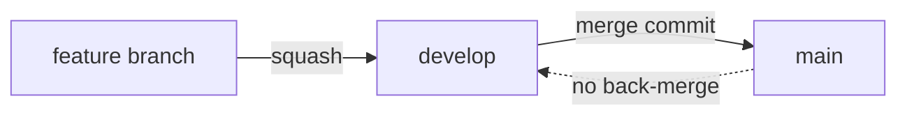
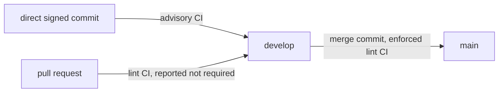
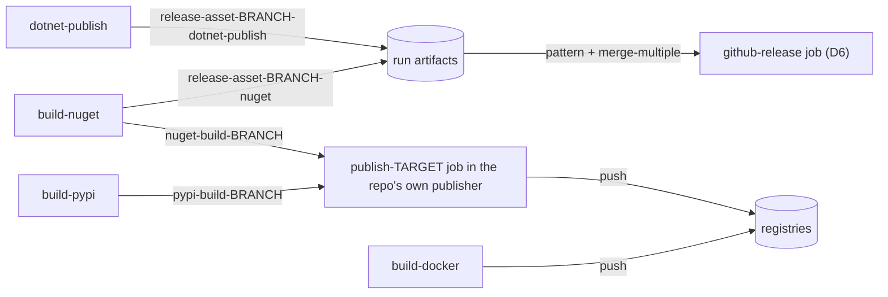
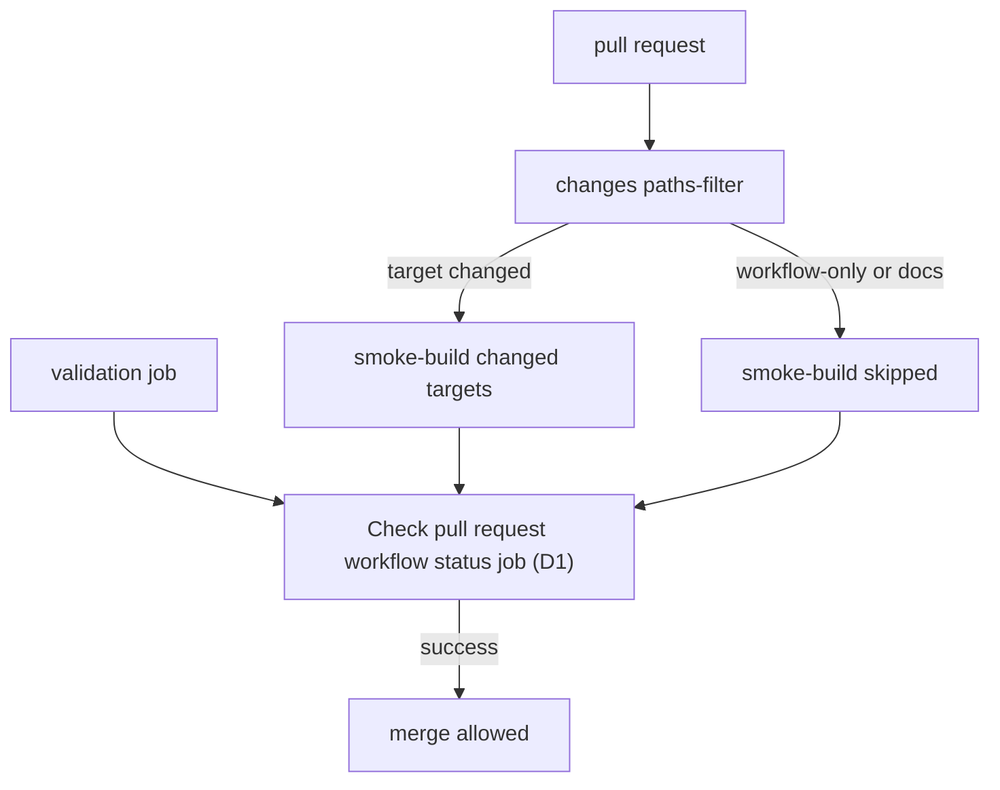
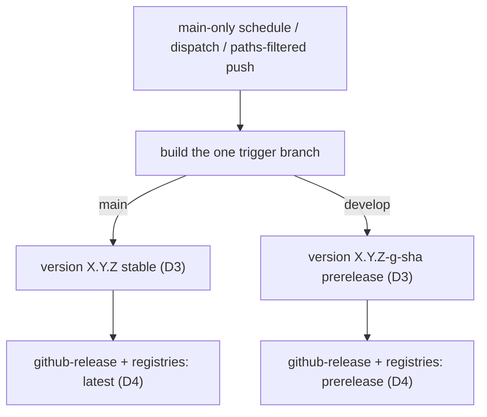

# WORKFLOW.md

The guide for CI/CD **workflows** (GitHub Actions): a deliberate mixture of architecture, a **behavioral contract** (expected inputs and outputs), and a **test methodology**, the workflow style rules having their home in `GOVERNANCE.md`. Code style lives in [`CODESTYLE.md`][codestyle]. This file is its sibling for the pipeline those workflows implement, which reaches past `.github/workflows/` to every file and repository setting a guarantee names, `version.json` and a branch ruleset's `context:` string among them.

Its defining principle: **it describes required outcomes.** Two repos may implement the same guarantee with different YAML wherever that guarantee names no construct, and where one is named, D6.1's `release-asset-<branch>-<target>` and D9.2's ruleset-bound job `name:` among them, matching it **is** the outcome. Section 4 is what a workflow must satisfy, and the verdict below is how that is judged. The style conventions that section 2 points at are part of that contract wherever section 4 states one as a guarantee, and a violation of one that it does is a defect on the same terms as any other.

Given this document and the `GOVERNANCE.md` sections it points at, an agent must be able to do three things to any project:

1. **Audit** - statically check the structural fact each applicable guarantee implies, the style conventions among them (section 5A).
2. **Test** - trace the expected inputs/outputs (section 5B) and, where warranted, drive a live probe (section 5C).
3. **Assess** - render a verdict: **operational** (every *applicable* guarantee holds, every *applicable* scenario's predicted output equals the expected, and no 5C probe that was run contradicts either) or **not operational** (any *applicable* mismatch, which is a *defect*).

> **Canonical scope.** An overlap between this document and `GOVERNANCE.md` resolves **by subject**, never by blanket precedence. This document wins on the applicability and N/A rules (section 1), the pipeline architecture (section 3), the contract (section 4), the test methodology (section 5), and the per-project-type walkthroughs (section 6). `GOVERNANCE.md` wins on the workflow style conventions, at its "Workflow YAML Conventions", which section 2 points at rather than restating; on the release policy, at its "Release Model"; on the branching model, at its "Branching Model"; and on what an operational repo is, at its "Operational Repositories". Section 3 summarizes those last three rather than owning them. Each file names where it defers.

The guarantees are distilled from failures observed in practice. Section 4's preamble states how each item is written.

## 1. Purpose and How to Use This Document

- **Contract, not implementation.** Conform to the *outcomes* in section 4. Shape, job names, and file layout may differ between repos wherever no guarantee names them, and where one does, as D9.2 does for the ruleset-bound job `name:`, that name is itself the outcome.
- **Applicability.** A guarantee, or a 5B scenario, is **applicable** only if the repo contains the construct it governs: a given target, a transfer artifact, a registry push, a wrapper-version source. An item that governs an absent construct is **N/A**: record it as N/A and **exclude it from the verdict**. N/A is never a defect. Section 6 names which constructs each project type adds: start from the constructs every repo has, its pull request workflow among them, **union what every declared type adds**, and record an item N/A only where nothing in that union supplies its construct. Which triggers a construct carries is read from the workflow itself rather than from the type, per section 6. Owning the release task rather than calling the hub-hosted copy changes where a construct's evidence is cited, per 5A, never whether it is applicable. A near-empty pipeline (source-only) is mostly N/A and that is fine.
- **Operational is binary.** A workflow is operational only where section 5's Assessment records all three of its conjuncts met. A single applicable failure is a defect and makes the workflow **not operational**, whether it is an input/output mismatch or a static property of the committed source such as an unpinned action SHA, regardless of how clean the YAML looks.
- **Default branch.** Guarantees say "default branch" portably. It is implemented as the literal `main` in several places (the validate gate, the `prerelease` expression, and `version.json`'s `publicReleaseRefSpec`). These MUST all reference the repo's *actual* default branch. A divergence is a defect (D3.2).
- **Two layers when auditing.** The pipeline splits into an **orchestrator** layer (the PR entry workflow, the publisher, and the version and release jobs) and a **build-leaf** layer (the `build-<target>` tasks, whether separate files or jobs inside the release task). Inputs like `github`/`dockerhub`/`expect_release_assets` live on the orchestrator. A leaf receives `ref`/`branch`/`smoke` and whatever else its own target needs, a derived `push` among them where that leaf pushes. A package target declares no push input on either layer, because section 3's `Output Seam by Destination` puts its push in a `publish-<target>` job in the publisher, gated by `needs:` rather than by a flag. Assert an input a guarantee names in the layer that declares it.
- **The three verbs.** Audit (static), Test (trace + probe), Assess (verdict). Section 5 gives the exact procedure.

## 2. Workflow Style Conventions

`GOVERNANCE.md` "Workflow YAML Conventions" keeps the style rules, and this section points at it rather than restating it. Workflow YAML takes the same line-ending policy as every other file, which `GOVERNANCE.md` "Documentation Style Conventions" routes to under "Line Endings". Read the style rules before editing a workflow. Section 4 carries several of them as guarantees of its own, and where it does, a violation is a defect rather than a nit. They are not sufficient on their own: a perfectly styled workflow can still violate the guarantees they do not cover.

## 3. Architecture

### Branch Model

Two workflow models, set per repo by the registry `workflowModel` field. `release` (default) is the feature-branch pipeline `WORKFLOW.md` specifies:

```mermaid
flowchart LR
  feature[feature branch] -->|squash| develop
  develop -->|merge commit| main
  main -.->|no back-merge| develop
```

`operational` repos (live-service config, `workflowModel: operational`) commit directly to `develop` and promote a known-good snapshot to `main` via an occasional PR:

```mermaid
flowchart LR
  edit[direct signed commit] -->|advisory CI| develop
  pr[pull request] -->|lint CI, reported not required| develop
  develop -->|merge commit, enforced lint CI| main
```

The direct commit is an **allowance, not a substitute for review**. The ruleset drops the pull-request *requirement*, which permits a direct push without withdrawing the pull request, so a change worth reviewing still takes one and both paths reach `develop` legally. Which changes those are is stated as a shape rather than a line count in `GOVERNANCE.md` "Operational Repositories", which owns the test and is the one place it is written, since nothing in a ruleset can apply it. What differs is when validation lands. On the direct-commit path the commit is already on the branch, so CI can only be advisory after the fact, and that is the accepted cost of the model. On the pull-request path the change has not landed, so validation is pre-merge and actionable, which is the moment it is worth the most, and the lint workflow's `pull_request` trigger therefore names `develop` alongside `main` (`WORKFLOW.md` section 6). That is what makes **D1.2** hold here, since its input is *any* PR and the operational model is no exception. The check is reported on a `develop` PR rather than required, because a required status check on `develop` binds the direct push too and would dissolve the allowance the model is built on.

Their CI is lint/validation only (editorconfig/EOL plus domain linters such as Home Assistant or ESPHome config validation or a firmware build, but **no unit tests**), so the D-guarantees in `WORKFLOW.md` section 4 that assume a build/test pipeline are **N/A** exactly as for `source-only` (`WORKFLOW.md` section 6). What binds: the promotion gate, where the `develop -> main` PR must pass the required `Check pull request workflow status job`, and the source-only release on manual dispatch (`releaseTrigger: dispatch-only`; tag + source zip). Branch-model rulesets are specified in `GOVERNANCE.md` "Branching Model" rather than in `WORKFLOW.md`.

### Two Layers: Orchestration vs Build

- **Orchestration** is generic and forms the standardization baseline **at the job level**: the single-branch publisher, the `get-version`, `validate-release`, and `github-release` jobs, and the `changes -> smoke-build -> aggregator` shape of the PR workflow. These job *bodies* should not need per-repo edits.
- **Build** is repo-owned in shape: the leaf a target runs. A repo owning its release task hosts its leaves itself. A repo calling the hub-hosted task shapes a leaf through a composite-action hook of its own, which the task runs in place of its hub default where that file exists. For the .NET, NuGet, and PyPI leaves it is `.github/actions/<job>/action.yml`, named for the build job (`dotnet-publish`, `build-nuget`, `build-pypi`). For the Docker leaf it is `.github/actions/docker-prepare/action.yml`, which a `docker_matrix` the caller passes bypasses along with the default. A `docker-build-base` hook, which has no default, builds a shared base layer where the caller sets `docker_build_base`.
- **What the repo curates** (by design, not a leak): the *list* of targets. A repo calling the hub-hosted release task reaches it by pin and carries no copy, so adding or dropping a target edits the caller's own surface. That is the `enable_<target>` value its publisher passes, the publisher's `on.push.paths` entries where it carries a `push` trigger, and `expect_release_assets` where the change adds the first file target or drops the last (D4.3). It is also the `changes` paths-filter entry + output + the `smoke-build` enable-forward in the PR workflow, plus the separate `publish-<target>` job for a package target. The release task's `enable_*` inputs, its per-target build jobs, and their `github-release` and `build-docker` `needs:` entries belong to the task, so a target the hub task declares no input for is a change to that task first (`WORKFLOW.md` section 6, the `library` row). A repo owning its release task edits those in its own file, where "verbatim" applies to the `github-release` job and the version/publish-plan logic, except that job's own `needs:` list, and never to the task's job list.

### The Seam Contract

A target contributes a file to the GitHub release by uploading a workflow artifact named `release-asset-<branch>-<target>`. The release job collects **every** matching artifact by **pattern** (`pattern: release-asset-<branch>-*` + `merge-multiple: true`), never an `artifact-ids:` naming one job's output. Canonical for **every** repo, single-target included. Switching to an `artifact-ids:` handoff forks the release download.

```mermaid
flowchart LR
  dotnet[dotnet-publish] -->|release-asset-BRANCH-dotnet-publish| store[(run artifacts)]
  nuget[build-nuget] -->|release-asset-BRANCH-nuget| store
  store -->|pattern + merge-multiple| rel["github-release job (D6)"]
  nuget -->|nuget-build-BRANCH| pub["publish-TARGET job in the repo's own publisher"]
  pypi[build-pypi] -->|pypi-build-BRANCH| pub
  pub -->|push| registries[(registries)]
  docker[build-docker] -->|push| registries
```

The diagram writes `BRANCH` and `TARGET` where the prose writes `<branch>` and `<target>`, because a mermaid label is sanitized as HTML at render and an angle-bracket placeholder is dropped as an unknown tag. This reaches node labels as well as edge labels, which is why the Release Model diagram below writes `X.Y.Z-g-sha` rather than bracketing its own placeholder.

### Reusable-Task Parameter Contract

Every leaf and the release task take `ref`, `branch` (the **logical** branch that drives config/tags/prerelease), and where relevant `smoke`. Branch-derived config keys off `inputs.branch` (the logical branch the caller passes). Artifact names carry the branch.

### Versioning

NBGV versions the branch being published. Each run builds a single branch (the trigger ref), so `GITHUB_REF` already names it and NBGV classifies it directly, and no `IGNORE_GITHUB_REF` override is required. The default branch is the public-release ref, so it builds clean `X.Y.Z`. Every other branch builds a prerelease `X.Y.Z-g<sha>`. `version.json`'s `version` is the major.minor floor. NBGV appends the git height as the patch. **NBGV and `version.json` are retained even by a repo with no compiled code**, since they are the source of the release tag (`SemVer2`) and `target_commitish` (`GitCommitId`) and the prerelease classification. The .NET SDK is pulled in only as the versioning toolchain. A package build derives its registry version from the same NBGV outputs: the PyPI version is the `X.Y.Z` core of `SemVer2`, any prerelease or build segment dropped, with a PEP 440 `.dev0` appended on the `develop` branch. A wrapper repo may drive its build/image version from an external committed `name -> version` state file while NBGV still tags the release.

### Validate-at-Entry

When a workflow's inputs carry a cross-input or input-versus-derived-state invariant, assert it **once** in a dedicated entry job/step the downstream jobs `needs:`, failing fast with `::error::` before any build or publish.

### Resource Lifecycle

Workflow artifacts are an **intra-run handoff** only. Durable copies live on the release/registry. The rule: a transfer artifact handed **between jobs** is deleted by exact name/pattern **at its point of consumption**, the delete is **gated to the half of the consumption whose failure would leave it not yet redundant** (D5.2 names the two halves), and it is **best-effort**. **Every** `upload-artifact` sets `retention-days: 1` as the universal failure-path backstop, so no terminal blanket-delete job is needed. The run is **never** blanket-deleted (`.artifacts[].id`). See D5.

### Fast PR Feedback

PRs validate fast and never publish: a paths-filter smoke-builds only changed targets. A validation job always runs. Smoke builds compile/lint/test but upload nothing and push nothing. One required aggregator gates the merge. See D1.

```mermaid
flowchart TD
  pr[pull request] --> ch[changes paths-filter]
  ch -->|target changed| sb[smoke-build changed targets]
  ch -->|workflow-only or docs| skip[smoke-build skipped]
  val[validation job] --> agg["Check pull request workflow status job (D1)"]
  sb --> agg
  skip --> agg
  agg -->|success| ok[merge allowed]
```

### Release Model

Each publish builds a **single branch**, the trigger ref (`main` a release, `develop` a prerelease), so there is no branch matrix and `github.ref` always names the built branch. A **human merge never auto-publishes**: a `plan` job (`publish-plan-task.yml`) decides once, and a job downstream of it either gates on its outputs or inherits the skip through `needs:`. A run publishes on a **code-affecting bot push to `main`** (the App merges every Dependabot/codegen PR, so `github.actor` gates it, and the publisher's own `on.push.paths` list also drops a non-substantive change like an Actions bump), a **manual dispatch** of `main`/`develop`, or a **main-only weekly schedule** (Docker, to refresh the base image). The `push` is main-only, so a develop bot merge publishes nothing (its prerelease comes via dispatch). A **source-only** repo publishes on **dispatch only**. Every release is a tag on the built commit plus a source archive, README, and LICENSE. Targets amend it with `release-asset-*` files, and a registry push contributes none, made by the Docker leaf for an image and by the separate `publish-<target>` job for a package. An unchanged version cuts no second release on a schedule or push trigger, while a dispatch refreshes it (D4.4). Docker re-pushes by design.

```mermaid
flowchart TD
  trig[main-only schedule / dispatch / paths-filtered push] --> one[build the one trigger branch]
  one -->|main| vmain["version X.Y.Z stable (D3)"]
  one -->|develop| vdev["version X.Y.Z-g-sha prerelease (D3)"]
  vmain --> relm["github-release + registries: latest (D4)"]
  vdev --> reld["github-release + registries: prerelease (D4)"]
```

### Output Seam by Destination

Pick each output's path by **where the artifact goes**:

- **File on the GitHub release** (zip, binary, packaged library): one leaf per output uploading `release-asset-<branch>-<name>`. The repo keeps `expect_release_assets: true` (its default).
- **Package-registry push** (NuGet, PyPI): the leaf builds and uploads a build artifact (`nuget-build-<branch>` / `pypi-build-<branch>`), and a separate `publish-<target>` job in the **publishing repository's own** publisher consumes it and pushes. Both registries publish through OIDC Trusted Publishing, never a stored API key, and two things put that push outside the leaf. Trusted publishing validates the OIDC token's `job_workflow_ref` claim, which names the workflow the job actually ran from, so a push made from a reusable workflow a *different* repository hosts is rejected at the token exchange, NuGet.org answering `HTTP 401` with `does not start with <owner>/<repo>/.github/workflows/`. That alone rules out a leaf another repository hosts. A leaf this repository hosts clears the claim, and the split still applies to it, because a called job declaring no `permissions:` runs under the calling job's whole grant, so a push anywhere inside the release task would put `id-token: write` on every job in it rather than at the one entry point D7.2 requires. The registered trusted-publishing policy therefore names the publisher, `publish-release.yml`. PyPI additionally gates its publish job behind an environment. NuGet.org binds its policy to the workflow file rather than to an environment and needs none. NuGet's leaf also uploads a `release-asset-*` carrying the package, and PyPI contributes none.
- **Image-registry push** (Docker): the leaf pushes the default branch multi-arch (amd64+arm64) and any other branch `amd64`-only (arm64 emulation is reserved for the released image), and contributes no `release-asset-*`.
- **Filesystem on a host the project owns** (a static site, a config tree): the leaf builds the tree, ships it to the host, and contributes no `release-asset-*`. The transport is the repo's own. What the contract fixes is that the deploy is a **separate `workflow_dispatch`** from the release, so a redeploy of an unchanged commit mints no tag and a host rebuild, a rollback, or proving a branch on a non-production environment costs nothing; that its credentials come from a **per-environment GitHub Environment** rather than the repository secret store; and that the deploy ends by asserting **what the host serves** rather than the transport's exit status (D4.6). Retention at the destination is bounded by a declared count with one side recorded as owning the prune, which is the deploy where its credential can observe the destination and the host where that credential is deliberately write-only (D5.6).
- **No file target via the release task** (Docker-only, PyPI-only, source-only): the release is tag + source zip + README + LICENSE. The caller **MUST pass `expect_release_assets: false`** to the release task. A publisher with file targets retains the default `true`. This setting is caller-specific. The default `true` fails on `fail_on_unmatched_files` when no assets exist. A **source-only** repo also passes every `enable_*` input as false because it has no build leaf (see `WORKFLOW.md` section 6).

`WORKFLOW.md` section 3 keeps the architecture, and the `workflow-ci-contract` Skill at `.agents/skills/workflow-ci-contract/references/architecture.md` in the hub, not a repo-relative link since that path is hub-local and not carried into every fleet repo, carries this section whole as a generated include.

## 4. Behavioral Contract: Expected Outcomes

The required behaviors, organized by domain. Each is a **MUST**, and its `Output:` states what a conforming pipeline is required to hold. An `Output:` may be a behavior a run exhibits, or a property of the committed source such as a SHA-pinned action or a `retention-days:` setting, and the two kinds bind on the same terms. An item may also carry an `Input:`, where the guarantee turns on a particular trigger or state rather than on every run, a *Prevents:*, where the failure it rules out is not evident from the `Output:` itself, and an *Implication:* or a *Note:*, for a consequence and for a caveat. Applicability is `WORKFLOW.md` section 1's rule rather than a label's, so an item scoped to a repository shape says so in its own prose. A workflow that violates any *applicable* guarantee is **not operational**.

### D1 - PR Fast-Feedback (Smoke)

- **D1.1 Only changed targets build.** Input: a PR touching some targets. Output: the paths-filter marks exactly those targets and only their smoke builds run. Unchanged targets skip. A repo's own targets MUST each have a filter entry (so a touched target is never silently skipped), and that entry lists paths rather than negating them, so a change matching no entry marks nothing and every smoke build skips. *Prevents: rebuilding everything, and a changed target slipping through unbuilt.*
- **D1.2 A validation job always runs.** Input: any PR. Output: a validation job runs unconditionally and the aggregator `needs:` it. That job is the caller's own job reaching the reusable validator, named `validate` in every shipped stub, and that name is what the aggregator's `needs:` carries. The validator's internal jobs (`lint`, `unit-test` and `validate` in the hub's `validate-task.yml`) are not addressable from a caller, so a `validate` in a caller's `needs:` list always names the caller's own job rather than the validator's internal one of the same name. The validator detects the tree rather than the repo's language, running the doc and repo gates everywhere, the `dotnet test` path only where a `*Tests*.csproj` project exists, and the `pytest` path only where a root `tests/` directory sits beside a root `pyproject.toml` and a root `uv.lock` or `requirements*.txt`, so a non-.NET repo calls the same one rather than replacing it. A repo whose tests take another shape can run them from its own `.github/actions/validate/action.yml` hook, which the validator runs where that file exists. That hook receives no secret, so a repo whose other-shape tests owe D1.6's coverage upload is one whose validation the validator cannot express. A repo whose validation it cannot express **replaces** the call (not deletes it) with its own validator and re-points the aggregator's `needs:` to the replacement. `smoke-build` `needs:` the `changes` job rather than the validation job, so no second `needs:` moves with it. *Prevents: a PR merging with no validation, or a dangling `needs:` that stops the whole workflow from loading.*
- **D1.3 Smoke never publishes and never uploads.** Input: `smoke: true`. Output: full compile/lint/test, but no registry/image push, no release, and **no** artifact uploads (every `upload-artifact`, including any aggregation job, is gated on smoke being false, written `!inputs.smoke` at the workflow layer and `inputs.smoke != 'true'` in a composite action, whose inputs are strings). *Prevents: a PR publishing, and orphaned artifacts churning the storage quota.*
- **D1.4 Workflow-file changes are not smoke-built.** Input: a PR changing only `.github/workflows/**`. Output: the paths-filter marks no target, so smoke-build skips. An inclusion list satisfying D1.1 reaches this by leaving workflow paths out of every target's entry. *Implication: a workflow-only change is not smoke-built, but actionlint still validates it in CI.*
- **D1.5 One required aggregator gates merge.** Input: any PR. Output: a single aggregator job must **succeed**, run under `if: always()` so a failed or skipped dependency cannot skip the gate itself, `needs:` the validation job, and the `changes` and `smoke-build` jobs too wherever the repo has a smoke build, treat a **skipped** smoke build as pass, and **block** on `failure`/`cancelled`. Its name is ruleset-bound: the job `name:` and the ruleset `context:` are the same string and MUST be renamed together, never independently. *Prevents: a paths-filter error letting a target-changing PR merge unbuilt.*
- **D1.6 Coverage is reported to Codecov (C# and Python).** Input: a C# or Python repo that has tests for that type. Output: the validation job runs those tests under coverage collection (`dotnet test --coverage --coverage-output-format cobertura --results-directory ./coverage`, leaving `--coverage-output` unset so each test project writes its own report rather than overwriting a shared one, or `pytest --cov-report=xml` over a repo whose own `pyproject.toml` selects what to measure) and a `codecov/codecov-action` step uploads the report, **best-effort** (`continue-on-error` and/or `fail_ci_if_error: false`, so a Codecov outage or an absent token never reds the gate). The Python leg **fails its test step when no report was written**, since `--cov-report=xml` alone selects nothing to measure. The C# leg renames each report to `coverage-<guid>.cobertura.xml` before the upload step reads the directory, `codecov-cli`'s own finder not matching the default name, and a repo owning its validator rather than calling the hub's owes that rename itself. `CODECOV_TOKEN` lives in the repo's **actions** and **dependabot** secret stores, the second because a run triggered by a Dependabot pull request reads the Dependabot store and the upload would otherwise skip silently on every bot pull request. A caller reaching the reusable validator across repositories names the secret it passes (`secrets:` with `CODECOV_TOKEN: ${{ secrets.CODECOV_TOKEN }}`), on its pull request path and its publisher path alike, because `secrets: inherit` is documented for a caller in the same organization or enterprise, which a personal account is not. A call by local path stays inside one repository, where the caller's own store is the one the callee reads, so `secrets: inherit` is available there instead of naming each secret. The repo ships a **`codecov.yml`** setting the project and patch statuses to **`informational: true`** so a coverage delta never gates a pull request (a repo whose quality bar requires a threshold may turn that off), and excluding intentionally-untested, non-shipped code (an example or benchmark project) from the denominator via `ignore`. Coverage output is a build artifact, so `.gitignore` excludes it. The C# invocation runs under **Microsoft.Testing.Platform**, and the runner declaration, package references, and version floor an MTP-based test project needs are `CODESTYLE.md`'s .NET side. The Python invocation needs **`pytest-cov`** and a coverage selector, which are `CODESTYLE.md`'s Python side. N/A for a repo carrying no tests for that type, and for a `lint-only` profile for it (per the hub's `registry/repos.json`). *Prevents: coverage silently going unreported, and a coverage regression blocking an unrelated pull request.*

### D2 - Input/State Validation at Entry

- **D2.1 Validate before expensive work.** Output: a dedicated entry job/step asserts each cross-input/derived-state invariant and fails fast before builds. Downstream jobs `needs:` it.
- **D2.2 Release branch matches version classification.** Input: a real (non-smoke) release build. Output: the gate fails loudly if the default branch carries a prerelease suffix **or** a non-default branch carries none. It strips `+buildmetadata` before testing for the prerelease `-` (only a core/prerelease `-` counts), and on a smoke build the **check exits early while the job still reports success** (a detached PR head always versions as prerelease). Read that as the validation being skipped rather than the job, because a job-level `if:` would skip the job itself, and a dependent whose `if:` carries no status-check function, an absent `if:` included, gets the implicit `success()` and skips with it. `validate-release` has such dependents, so a job-level skip there would skip their smoke builds with it. *Prevents: a non-default leg published as stable, a build-metadata false-positive, and the gate blocking every default-base promotion PR.*
- **D2.3 Publish only from main or develop.** Input: a dispatch publish. Output: a dispatch from any ref other than `main` or `develop` fails fast. *Prevents: cutting a release from an unintended branch.*
- **D2.4 Mutually-exclusive / paired inputs are validated.** Input: a workflow with either/or or must-pair inputs (e.g. the docker-readme task's `repositories` XOR `manifest`+`manifest-jq`). Output: a half-filled or conflicting combination fails fast. *Prevents: a silent fall-through.*
- **D2.5 The release gate refuses a branch input git would not accept as a name.** Input: a release task taking a `branch` input, on any run. Output: the gate runs `git check-ref-format --branch` over that value and fails when git rejects it, ahead of D2.2's smoke exit, with an error echoing no part of the value. *Prevents: a `::` or `##[` in a caller's value forming a workflow command wherever a later step prints the branch, on a smoke run as much as on a publish.*

### D3 - Versioning and Classification

- **D3.1 One branch per run.** Input: a publish triggered on `main` or `develop`. Output: the run builds and versions that one branch, and `github.ref` names it, so NBGV classifies it directly (no `IGNORE_GITHUB_REF`). *Prevents: a cross-branch ref mismatch misclassifying the version.*
- **D3.2 Default = public, others = prerelease.** Output: default branch -> `X.Y.Z`, and any other -> `X.Y.Z-g<sha>`. Every literal that keys default-branch behavior, `version.json`'s `publicReleaseRefSpec` among them, MUST name the repo's real default branch. The hub-hosted tasks and their default leaves write it as `main`, so a repo calling them has `main` as its default branch.
- **D3.3 Version floor + git height.** Output: `version.json` sets the major.minor floor. NBGV appends the git height as the patch, and the maintainer moves the version by bumping the floor. NBGV and `version.json` are retained even by a no-compiler repo (they own the tag).
- **D3.4 Registry versions follow the classification, per registry.** Output: NuGet default = stable, others = prerelease (derived by NuGet.org from the SemVer2 `-g<sha>` suffix on `PackageVersion`, not a flag the workflow sets). PyPI builds from the `X.Y.Z` core of `SemVer2`, any prerelease or build segment dropped, and appends `.dev0` on the `develop` branch only (a two-branch literal, not a generic N-branch rule). The develop build stays `pip install --pre`-selectable, `.dev0` being a PEP 440 development release. *Note: at a shared `version.json` floor, `M.N.P.dev0` sorts below `M.N.P` at equal height, so a develop build does not always lead the stable release. A develop-only floor bump leads on the floor whatever the heights.* *Prevents: a non-default leg published as a release.*
- **D3.5 Wrapper repos may use an external version.** Output: a repo wrapping an upstream release drives its build/image version from a committed `name -> version` state file, while NBGV still tags the release. *Note: the tracker (the writer) ships without consumer wiring, so a wrapper must wire the leaf to read the state file (e.g. `jq` into the image tag) instead of `SemVer2`. If the leaf still tags off NBGV, the wrapper is not actually pinned to upstream.*

### D4 - Release / Publish

- **D4.1 Gated single-branch publish.** Output: PRs smoke-test and publish nothing. A **human merge never auto-publishes**. A `plan` job (`publish-plan-task.yml`) decides once. A job downstream of it either gates on the plan's outputs or inherits the skip through `needs:`. A gate on an output compares it against `'true'` rather than testing it bare, since a job output is always a string. A publish runs on a **code-affecting bot push to `main`** (gated to the codegen App / Dependabot `github.actor`, with an Actions-only bump matching no release path and publishing nothing), a **dispatch** of `main`/`develop`, or a **main-only weekly schedule** (Docker). A source-only repo publishes on dispatch only. Each run builds one branch.
- **D4.2 Tag the built commit.** Output: the release `target_commitish` is the built commit's SHA (NBGV's `GitCommitId`), never a branch name or a separately re-resolved ref. *Prevents: the tag landing on the default branch instead of the built tree.*
- **D4.3 Release contents.** Output: every release contains a tag on the built commit plus the auto source zip, README, and LICENSE. File targets attach `release-asset-*`. The `prerelease` value equals `branch != default`. A no-file-target caller sets `expect_release_assets: false` to reach the no-asset shape. This applies to Docker-only, PyPI-only, and source-only repos. A NuGet target is not among them, since its leaf uploads a `release-asset-*` carrying the package, so a NuGet-only caller keeps the default `true`. The setting relaxes `fail_on_unmatched_files` and skips the asset download. The release-create step fails when no assets exist and the setting retains its default `true`. A source-only caller also sets every `enable_*` input false.
- **D4.4 No-op republish.** Input: a re-run whose version is unchanged, on a schedule or push trigger. Output: no second release is cut, because the release-create step is skipped when `gh release view` finds a release for the tag, and the paired asset-delete is skipped with it. A **dispatch** re-run refreshes the release instead and runs that delete with it, which is why a dispatch-only publisher records this item's skip leg as unreachable rather than failed. Package-registry pushes are no-ops. The NuGet/PyPI publish steps are **not** statically gated on existence. They run and the **server** dedupes (`dotnet nuget push --skip-duplicate` turns a 409 into success, and PyPI does the same under `skip-existing: true`). **Docker always re-pushes** the image (base-image refresh), independently of the release-create skip, within the same run. *Prevents: duplicate releases and wasted pushes.*
- **D4.5 A build failure blocks every publish target, within the Docker limit below.** Input: a real publish where one enabled build fails. Output: nothing publishes. The limit: where a Docker target builds a shared base or more than one image, its task pushes the base and each image leg as it builds, so a leg failing after the base or a sibling leg pushed leaves those images in the registry with no release. `github-release` needs every build and carries the same `!failure() && !cancelled()` guard the terminal registry pusher (Docker) does, since the implicit `success()` would otherwise skip both on every run that disables a target rather than only on a failed one. A failed build therefore skips the release (no tag, no release), and Docker, which needs every other build, skips with it (no image push), while a **disabled** target, skipped rather than failed, still lets docker push. A package target's separate publish job needs its own gate for the same reason, since it sits outside the `github-release` and Docker `needs:` chains: it `needs:` the release-task call, so a failed build skips it with the rest. The push itself is what no gate can cover, because it runs after the whole release task and therefore after `github-release`, for the trusted-publishing reason `WORKFLOW.md` section 3's "Output Seam by Destination" package-registry bullet gives, so a rejected token exchange, a registry outage, or a trusted-publishing policy naming the wrong workflow file leaves a published release and tag for a version that never reached the registry. The recovery is a re-dispatch or a full re-run rather than a cleanup. **A full re-run is always available inside its window and is the only route once the branch tip has moved.** The `Re-run failed jobs` shortcut is not a third route here, D5.2's delete having already removed the artifact it would download. `GOVERNANCE.md` "Release Model", and the skill it routes to, carry the mechanics of each route, how to choose, and the window. *Prevents: a partial publish, e.g. a Docker image pushed while .NET publish failed and no release was cut.*
- **D4.6 Deploy verification names the release.** Input: a deploy to a filesystem on a host the project owns that completes without error. Output: a check against the running host asserts **which release is answering**, not merely that it answers. The artifact stamps its own version into the configuration it ships, and the check compares that against the version just installed, **waiting for convergence to a bounded timeout** rather than sampling once, because content goes live the instant a pointer moves while server rules wait on an asynchronous reload. The same check asserts **which environment** answered, since several environments serve a byte-identical artifact and a proxy rule aimed at the wrong one answers healthily under the right hostname. An unreachable host is reported distinctly from an HTTP status. *Prevents: a green deploy over a host still serving the previous release's configuration, a URL contract checked against the wrong environment, and a dead config watcher read as a routing fault.*

### D5 - Resource Cleanup

- **D5.1 Delete at the point of consumption.** Output: the job that downloads a **cross-job** transfer artifact deletes it (by exact name/pattern) right after consuming it. *Prevents: transfer artifacts accumulating against the storage quota.*
- **D5.2 Gate the delete by the kind of consumer it follows.** Output: where the consumer is a conditional step (the GitHub release create), the delete carries that same condition, narrowed by `inputs.expect_release_assets`. Where the consumer is a step that always attempts once its job runs (a package publish job's push), the delete is gated on the **download** having succeeded rather than on the push, as `if: ${{ !cancelled() && steps.<download-step-id>.outcome == 'success' }}`. A step whose `if:` carries no status-check function, an absent `if:` included, inherits `success()` instead, which skips it on exactly the failed push where the artifact is already downloaded and the release is already cut. So on a no-op re-run that is not a dispatch the `release-asset-*` delete is **skipped** with the release create it follows, while the `nuget-build-*` and `pypi-build-*` deletes still **run**. A dispatch re-run refreshes the release instead (D4.4), so its asset delete runs with it. Deleting the `nuget-build-*` or `pypi-build-*` artifact on the failed-push path costs the run its **Re-run failed jobs** route, since the re-run's download then finds nothing, so the recovery for a failed push is one of the two routes D4.5 names, and `GOVERNANCE.md` "Release Model", with the skill it routes to, sets out how far that cost actually reaches. *Prevents: deleting freshly built assets on a no-op re-run, and stranding a downloaded artifact when the push it fed fails.*
- **D5.3 Best-effort.** Output: cleanup is `continue-on-error`, tolerates a failed listing, and deletes **all** matching ids. *Prevents: a cleanup hiccup reddening a job whose publish succeeded.*
- **D5.4 Retention backstop.** Output: **every** `upload-artifact` sets `retention-days: 1`.
- **D5.5 Never blanket-delete.** Output: cleanup MUST NOT enumerate and delete the run's whole artifact set. *Prevents: destroying diagnostic/log artifacts and auto-emitted build-records.*
- **D5.6 A durable destination's retention is bounded and owned.** Input: a deploy that installs a release beside the retained ones on a host the project owns. Output: retention is bounded by a **declared count**, and the side owning the prune is **written down**. Where the deploy credential can observe the destination, the deploy asserts the count converged and fails when it does not. Where the credential is deliberately write-only, so it can neither delete nor read back, the prune belongs to the **host** and that ownership is recorded there: widening the credential to reach the destination would trade a real confinement boundary for a check, which is the wrong trade. The release the live pointer resolves to is never a prune candidate, whatever the sort order says. A prune that runs against a local scratch tree, or that is best-effort, or that no side is recorded as owning, satisfies none of this. Unlike D5.1 through D5.4, this destination is durable rather than a run-scoped artifact, so no retention backstop expires it. *Prevents: a destination growing without bound until the disk fills, which surfaces as a site outage rather than as a failed deploy; and the split-ownership version of the same, where each side assumes the other prunes.*

### D6 - Seam / Architecture Conformance

- **D6.1 Pattern handoff.** Output: the release job downloads by `pattern:`/`merge-multiple:`, not `artifact-ids:`. **File** targets upload `release-asset-<branch>-<target>`, and a target contributing no file to the release (Docker, PyPI) uploads no `release-asset-*` of its own, per D4.3, whatever other transfer artifact it uploads. The `pattern:` download is canonical for a single-target repo too, which does not special-case itself to `artifact-ids:`.
- **D6.2 Branch drives config.** Output: a called workflow's branch-derived config reads `inputs.branch`, never `github.ref_name`.
- **D6.3 Branch-named artifacts.** Output: every artifact name carries the branch, so a branch's artifacts do not collide with another branch's.
- **D6.4 Target add/drop is consistent.** Output: adding or dropping a target updates **all** of: the `enable_<target>` value the publisher passes to the release task, the publisher's `on.push.paths` entries where it carries a `push` trigger, the `changes` paths-filter entry + output, the `smoke-build` enable-forward, and `expect_release_assets` where the change adds the first file target or drops the last (D4.3), plus, for a package target, the separate `publish-<target>` job. A repo owning its release task also updates the target's build job there, `build-<target>` or `dotnet-publish` for the .NET target, and its `github-release` and `build-docker` `needs:` entries. Everything in the `github-release` job **except its `needs:` list** stays verbatim, and so does the version and publish-plan logic. "Verbatim" never reaches the surfaces this item requires editing, that `needs:` list, the release task's job list, and the paths-filter among them. *Prevents: a partial subset that startup-fails on a missing leaf or never smoke-builds a target.*

### D7 - Concurrency, Permissions, Safety

- **D7.1 Publisher serializes.** Output: the publisher uses a **global, ref-independent** concurrency group with `cancel-in-progress: false`. *Prevents: a schedule and a dispatch double-pushing, or a cancelled publish leaving a partial release.*
- **D7.2 A called job's permissions block is validated before its `if:`.** Output: a reusable job declares `permissions:` only where **every** caller grants that scope at startup, and otherwise declares none and runs under whatever the calling job granted. A callee's extra scope (e.g. `actions: write` for cleanup, or `id-token: write` for OIDC) is granted by the caller and appears at exactly the one entry point that needs it. *Prevents: a `startup_failure` on every caller that does not grant a scope only one target needs, including a smoke build under a read-only pull request token.*
- **D7.3 A `github.event.inputs` boolean is compared as a string.** Output: a boolean read through `github.event.inputs.<name>` is compared against `'true'`, since that context delivers every input as a string whatever the input's declared type. Comparing it against the boolean `true` as well is dead rather than defensive: an operand-type mismatch casts each side to a number, a non-numeric string casts to `NaN`, and `NaN` compares equal to nothing, so `github.event.inputs.<name> == true` is false even on the run where the input arrived as `true`. The `inputs` context preserves the declared boolean on the `workflow_call` and `workflow_dispatch` paths alike, so an `inputs.<name>` read is used directly, and a both-forms comparison there is redundant rather than wrong, which is why the hub's Docker build task comparing its `build-base` input in both forms is not a finding. A workflow carrying both trigger blocks declares each boolean input in both, since one declaration does not propagate to the other, while a boolean that only ever arrives by `workflow_call` is declared in that block alone. `smoke` is such a boolean, every hub task declaring it being `workflow_call`-only, which is why D1.3 writes the workflow-layer gate `!inputs.smoke` against the real boolean and the composite-action gate `inputs.smoke != 'true'` against a string, a composite action's inputs being strings whatever their caller passed. A job or step **output** is always a string as well and takes the same `== 'true'` rather than a bare truthiness test, since the string `'false'` is truthy. *Prevents: a dispatch-path string read as truthy, and a comparison against the boolean `true`, which can never fire, standing in for the one that can.*
- **D7.4 Optional-dependency chaining.** Output: a cross-job condition chaining across an **optional** dependency allowlists `success`/`skipped` explicitly, paired with a status-check function such as `always()` or `!failure() && !cancelled()`. Without one the implicit `success()` applies and is false the moment any `needs:` job skipped, which is the case the allowlist exists to admit. *Prevents: a condition that reads as tolerant of a skipped dependency and is dead in exactly that case.*

### D8 - Bots / Automation

- **D8.1 Merge-bot.** Output: enables auto-merge on `opened`/`reopened` for **every** Dependabot tier including semver-major (the required checks are the gate, not the bump magnitude); dispatches `--squash`/`--merge` by the PR's base ref; disables on a maintainer-pushed `synchronize`; concurrency keyed on the **PR number**, not `github.ref`. *Prevents: two PRs colliding in auto-merge.*
- **D8.2 CodeGen and Dependabot.** Output: codegen runs as a matrix over both branches and is deterministic from an external source. `.github/dependabot.yml` targets both branches, and security PRs go to the default branch.
- **D8.3 Upstream-version tracker.** Output: a scheduled resolver prints a JSON `name -> version` object to a committed state file, opens a rolling per-branch bump PR naming only the moved keys, the merge-bot auto-merges it. The `main` pin push publishes via the release gate, while a `develop` pin does not auto-publish. It ships via a `develop` dispatch (prerelease) or the next promotion to `main`. The tracker's `bump-branch-prefix` + `branches` MUST match a merge-bot rule, one of the built-in `<prefix>-<base>` head/base pairs or a `rules` entry the caller passes, or auto-merge silently never fires. A tracker whose bump needs a human decision instead sets `auto-merge: false`, which prefixes the head so no merge-bot rule matches it, whatever `bump-branch-prefix` names.
- **D8.4 An identity allowlist used as a gate fails loud.** Where a gate compares `github.actor` (or a PR author) against hard-coded bot identities, the non-matching branch on an otherwise-legitimate trigger **emits a `::warning::`** rather than falling through silently. Output: a run that declines to act on an unrecognized identity is visibly annotated. *Prevents: the App being renamed, replaced, or reinstalled under a new slug, after which the comparison quietly evaluates false and the gate stops firing, a green and silent run that looks identical to a healthy one.* The masking matters most where a second path hides the loss: a weekly schedule keeps publishing, so the only symptom is release *timeliness*, easily missed for months. Where the failure is self-announcing instead (the merge-bot simply stops merging, so bot PRs visibly pile up) an annotation is optional. Resolving the identity at run time (mint an App token, read `GET /app`) removes the hard-coded string entirely and is the escalation if an allowlist proves fragile in practice.

### D9 - Style / Static

`GOVERNANCE.md` "Workflow YAML Conventions" names the tool D9.1 excepts and states the suffix rules D9.2 requires.

- **D9.1** Every action or reusable workflow referenced from another repository is SHA-pinned with a version comment (sole exception: the documented lagging-tag tool). A local (`./`) or self-repository (`$/`) reference names no ref and takes no pin.
- **D9.2** File/workflow/job/step names follow the suffix rules. A ruleset-bound job's `name:` equals its ruleset `context:` (renamed together).
- **D9.3** Multi-line bash `run:` blocks start `set -Eeuo pipefail`. Multi-line `if:` uses `>-`.
- **D9.4** Docker layer cache targets a registry tag, not `type=gha`. `cache-to` writes only the built branch's `<repo>:buildcache-<branch>` and only on push, while `cache-from` reads both branches. A multi-image repo varies the cache **repository** rather than the tag, `<image>:buildcache-<branch>` per image, the tag alone being unable to distinguish two images.
- **D9.5** Line endings follow `.editorconfig`.

`WORKFLOW.md` section 4 keeps the D-guarantees, and the `workflow-ci-contract` Skill at `.agents/skills/workflow-ci-contract/references/d-guarantees.md` in the hub, not a repo-relative link since that path is hub-local and not carried into every fleet repo, carries this section whole as a generated include.

## 5. Test Methodology

An agent verifies a project in three escalating modes, then renders a verdict. **Skip N/A items** (`WORKFLOW.md` section 1): a guarantee or scenario for an absent construct is recorded N/A, not failed.

### 5A. Static Audit (No Execution)

Assert the structural fact each *applicable* D-guarantee implies, and record **pass**, **fail**, or **N/A** per item. This section says how an audit is run and recorded rather than what must hold: a guarantee names its own constructs, and the requirement is `WORKFLOW.md` section 4's item together with whatever that item defers to.

Most of the evidence is in the workflow files and the composite actions they reach. Where a guarantee's evidence lies outside them, it is in practice the repo's branch ruleset, its Actions and Dependabot secret names, a workflow the repo only calls, a project or dependency file, or a committed file such as `version.json`, `.github/dependabot.yml`, `global.json`, `codecov.yml`, `.gitignore`, or `.editorconfig`.

Cite what each verdict rests on. That is `file:line` for a file in the audited repo, its own name where a setting, a ruleset, or a secret name rather than a file is the evidence, and `<owner>/<repo>@<sha>` plus the `file:line` in that repo where the guarantee binds a workflow or composite action the audited repo only reaches, read at the SHA the caller pins. An **N/A** verdict names the absent construct instead, there being no line to cite.

### 5B. End-to-End Trace Scenarios (No Execution, Deterministic from the YAML)

For each *applicable* scenario, evaluate every job's `if:`/`needs:` against the inputs and emit the predicted **run/skip + version + release + artifact-end-state** table, then compare to the expected. A scenario governing a construct the repo does not contain is N/A, per `WORKFLOW.md` section 1, and an absent trigger is such a construct. Each scenario's trigger belongs to one workflow, so read that workflow's own `on:` block rather than the repo's type: S1 to S4 the pull request workflow's, S5 to S10 the publisher's, S11 the upstream tracker's, and S12 and S13 the deploy workflow's. A publisher carrying only `workflow_dispatch` therefore records S5, S6 and S9 N/A, their push and schedule paths never firing there, and a repo with no publisher at all records S5 to S10 N/A together. Where a scenario's path runs through a workflow or composite action the repo only **calls**, trace that callee as the repo reaches it, read at the SHA the caller pins rather than at the callee's current default branch, which is the same evidence rule 5A states. Predicting from the callee's `main` predicts a table for YAML the audited repo never runs. A local (`./`) or self-repository (`$/`) call carries no pin of its own and runs at the workflow commit, so it is traced at whatever SHA the outermost pinning caller fixed. Minimum set:

| # | Input | Expected output | Exercises |
| --- | --- | --- | --- |
| S1 | PR touching a build target | `changes` flags it; validation runs; that target's smoke build runs; no push, **no uploads**; validate-release **succeeds**, its check exiting early on smoke per D2.2; release **skipped**; aggregator **success**; version = prerelease; no release; no dangling artifacts | D1, D2.2, D3 |
| S2 | PR changing only docs | smoke-build **skipped**, validation runs, aggregator **success** | D1.1, D1.2, D1.5 |
| S3 | PR changing only `.github/workflows/**` | the filter marks no target -> smoke-build **skipped**, validation runs, aggregator **success** | D1.2, D1.4, D1.5 |
| S4 | PR base = default branch, carrying a build target | smoke versions as prerelease, validate-release **succeeds** with its check exited early per D2.2, so the default-branch arm does **not** fire, aggregator **success**, promotion not blocked | D1.5, D2.2, D3.2 |
| S5 | bot push to `main` not touching a release path (e.g. an Actions bump) | the paths filter excludes it, so nothing publishes | D4.1 |
| S6 | code-affecting **bot** push to `main` (a human push/promotion, or any develop push, does not) | the `plan` job gates it to the App/Dependabot actor, and `main` publishes a release | D3, D4 |
| S7 | publish run (schedule, a bot push to main, or a dispatch) | builds the **one** trigger branch: `main` -> `X.Y.Z`, `prerelease=false`, registry stable, readme run; `develop` -> `X.Y.Z-g<sha>`, `prerelease=true`, registry prerelease; `release-asset-*` consumed-then-deleted; each package build-artifact (`nuget-build-*`, `pypi-build-*`) deleted after its publish; **no dangling artifacts** | D3, D4, D5, D6, D7 |
| S8 | dispatch from a ref other than `main` or `develop` | **fails fast** | D2.3 |
| S9 | re-run publish on a schedule or push trigger, version unchanged (a dispatch re-run refreshes the release instead, per D4.4) | release-create **skipped**, `release-asset-*` delete **skipped**; NuGet/PyPI pushes no-op (server dedupe); **package build-artifacts still deleted** (their download succeeded); **Docker still re-pushes** the image; no duplicate release | D4.4, D5.2 |
| S10 | branch/version classification disagree | validate-release **fails loud**, build/publish skip | D2.2 |
| S11 | scheduled upstream-version bump (wrapper) | resolver detects a change -> commits the state file -> opens a per-branch bump PR -> the merge-bot auto-merges it, or leaves it for the maintainer where the tracker sets `auto-merge: false` (D8.3) -> the `main` pin publishes via the gate (a develop pin does not auto-publish, shipping instead via a develop dispatch or promotion) | D8.3, D3.5 |
| S12 | deploy dispatch naming an environment | the ref gate runs **first** (production from the default branch only, any ref to a non-production environment); validation runs; the callee re-asserts the environment name; a release installs under its own id; the pointer flips as a separate step; retention is bounded by whichever of the two D5.6 shapes the repo uses, so a deploy whose credential can observe the destination asserts the count converged and one confined write-only leaves it to the host; the live check asserts the environment and the release id, waiting out the reload, then the URL contract; **no tag and no release are created** | D2.1, D4.6, D5.6 |
| S13 | deploy dispatch of a production environment from a non-default ref | **fails fast**, before anything is installed or written | D2.1 |

### 5C. Live Probe (Where Warranted)

Every probe here that opens a pull request, dispatches a workflow, or re-runs a real publish is the maintainer's to run, with the agent preparing the command and reading the result back afterwards. A harness that refuses such a write is the harness working as intended, and the refusal is neither re-shaped into a raw API call nor talked around (`GOVERNANCE.md` "Repository Boundaries and Write Safety").

- Open a trivial-change PR touching one target and confirm S1. *Caveat: the Docker leg logs in to the registry even on smoke and reads the buildcache, so it needs `DOCKER_HUB_*` secrets and cannot run on a fork PR (same-repo only).*
- Per registry: after a real publish, query NuGet.org for the expected version + prerelease classification (and the `.snupkg` on the symbol server), and confirm a re-run added no duplicate. For PyPI read the built `dist/*` filenames out of the build job's log, `.dev0` off `develop` vs a plain version on the default branch.
- Inspect the latest real publish's logs for `PublicRelease`/`SemVer2` per leg and confirm the artifact lifecycle (uploaded, consumed, deleted, with none left behind).
- **The deploy ref gate (S13) is verified only by tripping it.** Dispatch the production environment from a non-default ref and expect the run to fail at the gate. The evidence is four things, and each of them matters: the gate job's conclusion, its error text naming the expected and the received ref, every downstream job recorded as **skipped** rather than passed, and the production environment's deployment list carrying no deployment from the dispatched ref. Capture all four, because a gate that fails open and a gate nobody tripped produce the same empty run history, so "we have never seen it fail" is not evidence about the one control standing between a mis-dispatch and the live site. **The agent prepares the command and reads all four back afterwards. It does not fire it.** The same split applies to any probe that acts on the deploy host directly, an outbound SSH exercising a forced command among them.

### Assessment

Record the workflow **operational** when every *applicable* 5A item passes, every *applicable* 5B scenario's predicted output equals the expected, and no 5C probe that was run contradicts either. N/A items are excluded, never counted as failures. Any *applicable* mismatch is a **defect** -> **not operational**. Procedure:

1. **Audit** with 5A, recording each item's verdict and its evidence in the form 5A sets out.
2. **Trace** the applicable S-scenarios with 5B. Diff predicted vs expected.
3. **Probe** with 5C where a live signal exists that the static trace cannot produce, running the probes that only read and preparing the writing ones for the maintainer: live version classification, registry state, the artifact lifecycle of a real run, and the deploy ref gate.
4. **Verdict:** operational / not operational, with the failing guarantee(s) and the triggering input for each, the list of items recorded N/A, and the 5C probes prepared but not run.

`WORKFLOW.md` section 5 keeps the test methodology, and the `workflow-ci-contract` Skill at `.agents/skills/workflow-ci-contract/references/test-methodology.md` in the hub, not a repo-relative link since that path is hub-local and not carried into every fleet repo, carries this section whole as a generated include.

## 6. Per-Project-Type Test Walkthroughs

Each type adds constructs to the pipeline, and the constructs are what decide a verdict. This section states what each type **adds**. Section 1's applicability rule turns that into the N/A set on its own: an item governing a construct the repo does not contain is N/A, and one governing a construct it contains is checked. No row here states an N/A list of its own, deliberately, so that reading one row can never take away a construct another row supplies. Walking the rows a repo's types select is the self-check that the contract holds for its shape.

Three rules govern reading a row, each of them because reading one row alone has produced a wrong verdict.

- **Types union, they do not choose.** A repo declaring more than one type contains the constructs of **every** type it declares, so an item is N/A only where no declared type supplies its construct. `source-only` beside another type is the case that catches a reader out: it adds no build target and takes none away.
- **The trigger scenarios come from the publisher's own `on:` block, not from the type.** S5, S6 and S9 turn on which triggers the publisher actually carries, and two repos of one type routinely differ there. Section 5B's preamble owns that rule and it binds here.
- **N/A names an absent construct, never an unexercised one.** The `pattern:` download (D6.1) and the `release-asset-*` cleanup step (D5.1 to D5.3 and D5.5) live in the release task, so a repo that owns that task and a repo that calls the hub-hosted copy both contain them and are both checked on them. Ownership decides only where the evidence is cited, in the repo's own file or at the SHA it pins, which is the form 5A gives. Section 5A requires an N/A verdict to name the construct that is absent, so an item that cannot be recorded that way is applicable.

The table files each of S1 to S13 under exactly one row, which is what covers the set without a per-type list restating it. Filing is not the whole applicability test: a scenario is N/A when **any** construct it needs is absent, and that can be more than the row it sits under, S1 needing the pull request workflow as well as the build target.

| Construct the repo contains | Scenarios it reaches |
| --- | --- |
| A pull request workflow with a validation job and the required aggregator | S2, S3 |
| A build target: a `changes` filter entry, a smoke build, and a leaf that builds it | S1, S4 |
| A publisher, meaning a workflow that cuts the release | S7, S8, S10, plus S5 and S6 wherever its own `on:` admits a push, and S9 wherever it admits a push or a schedule |
| An upstream-version tracker and its merge-bot | S11 |
| A deploy workflow targeting a filesystem on a host the project owns | S12, S13 |

The rows below say which constructs a type brings with it. Read the repository for the rest: NBGV, `version.json` and the classification gate are reached on the smoke path too, so a repo with no publisher can still contain them, and a repo whose `releaseTrigger` is `none` has no publisher whatever its types say.

What each type adds beyond that, and how its leaf behaves, is below.

- **`dotnet-publish`.** The target runs a sequential `dotnet publish` runtime loop inside one composite-action job. Configuration is Release on the default branch and Debug otherwise. A non-smoke run builds the full runtime set, archives the combined output as a `.7z`, and uploads it as `release-asset-<branch>-dotnet-publish`. The archive is named from the project file stem unless `dotnet_publish_asset_name` overrides it. A smoke run builds a **strict, non-empty subset** of that runtime set and skips the archive and upload steps, so it uploads nothing. S1 smoke-builds that subset after a .NET project change. Where the repo has a publisher, S7 attaches the 7z from a non-smoke run. The non-default leg sets `prerelease=true`, and the default leg sets `prerelease=false`. GitHub marks the stable default release "Latest" automatically.
- **`nuget`.** The leaf uploads both `release-asset-<branch>-nuget` and `nuget-build-<branch>` on a non-smoke run and pushes nothing, and a separate `publish-nuget` job in the repo's own publisher consumes the second and runs `dotnet nuget push *.nupkg --skip-duplicate`, then deletes it under the download step's own success (D5.2). Section 3's `Output Seam by Destination` says why the push sits there rather than in the leaf. Configuration is Release on the default branch, Debug otherwise. Where symbols are enabled (`snupkg`), the push auto-carries the paired `.snupkg` to NuGet.org's symbol server and the release-asset `.7z` also contains it, a triple surface. NuGet.org derives `isPrerelease` from the SemVer2 `-g<sha>` suffix (the workflow sets no such flag). Test: S7 non-default leg publishes a prerelease package + asset, default a stable; S9 re-run is a server-side `--skip-duplicate` no-op. 5C: query NuGet.org for both versions and the symbol package.
- **`pypi`.** The leaf builds and uploads `pypi-build-<branch>`. A **separate** `publish-pypi` job (with `environment: pypi`, `id-token: write`, `actions: write`) does the OIDC Trusted-Publishing upload with `skip-existing: true`, then **consume-then-deletes** the build artifact under the download step's own success (D5.2), so on S9 it is deleted even though the `release-asset-*` delete is skipped. The version is the `X.Y.Z` core of `SemVer2` with `.dev0` appended on `develop` only, per D3.4. PyPI contributes no `release-asset-*`. A PyPI-only repo sets `expect_release_assets: false` at the caller. Test: S7 default leg publishes a release, non-default a `.dev0`; S9 is a `skip-existing` no-op; 5C inspects the `dist/*` filenames and the compute-version log.
- **`docker`.** The leaf pushes the default branch multi-arch (amd64+arm64) and any other branch `amd64`-only, with a per-branch registry buildcache. A single-image repo caches to `<repo>:buildcache-<branch>`, and a multi-image repo varies the cache **repository** rather than the tag, `<image>:buildcache-<branch>` for each image, since the tag alone cannot distinguish two images (`cache-to` writes only the built branch and only on push, `cache-from` reads both branches). It contributes no `release-asset-*`, so a Docker-only repo's caller passes `expect_release_assets: false`. The readme job (`peter-evans/dockerhub-description`, `DOCKER_HUB_ACCESS_TOKEN`) runs **only** when the default branch publishes, whether called directly or reached through the hub-hosted `publish-docker-readme-task.yml`. Where the Docker Hub overview differs from the project README, the repo publishes a `Docker/README.md` through that task, the Hub description being size-limited. The docker-readme task validates its two mutually-exclusive input sources, `repositories` against `manifest`+`manifest-jq`, and defaults to the calling repository where neither is supplied, and a multi-image repo derives its publish matrix from the manifest. Docker **always re-pushes** the image, independently of a skipped release-create (S9). Test, under the default tag matrix, which a caller-supplied `matrix` or `docker-prepare` hook replaces: S7 default leg pushes `latest` + the version tag and updates the readme. Non-default pushes `develop` + the version tag (amd64 only). S9 still re-pushes. 5C Docker probe needs `DOCKER_HUB_*` secrets and same-repo (not fork) runs.
- **`library` (a worked example, not a fleet type).** No such leaf ships, so this row walks D6.4's add-a-target procedure rather than an existing shape: a single new leaf that validates, zips, and uploads `release-asset-<branch>-library` (`retention-days: 1` per D5.4, upload gated on smoke being false per D1.3). Adding it means a new `enable_library` input, a `build-library` job and its `github-release` and `build-docker` `needs:` entries in the release task, a `library` paths-filter entry, `changes` output, and `smoke-build` enable-forward in the PR workflow (without that last one, D1.1 never smoke-builds the library), and in the publisher the `enable_library` value it passes and the library's paths in its `on.push.paths` where it carries a `push` trigger. **Only a repo that owns its release task can make the release-task half of that edit.** The hub-hosted release task declares a closed input set and a call passing an input it does not declare fails, so for a repo calling it adding a target is a change to the hub task first, and the enable-forward and the publisher's value wait on it. Keep `expect_release_assets: true` (it has a file target, unlike Docker). The caller's own validation job is replaced by a type-appropriate validator only where the reusable one cannot express this repo's validation, with the aggregator re-pointed to the replacement (D1.2). `smoke-build` keeps `needs: [changes]`, as D1.2 has it. `version.json` and the NBGV `get-version` **job** are retained (they own the tag). Test: S1 smoke runs validate+zip and uploads nothing; S7 attaches the zip, prerelease on the non-default leg; S9 on a push re-run skips release-create and the asset-delete (the existing zip is untouched, no registry push), while a `workflow_dispatch` re-run is D4.4's refresh case rather than S9's, re-uploading then re-deleting the asset.
- **`upstream-wrapper`.** The repo tracks an upstream project's releases rather than versioning its own code. A scheduled resolver writes a `name -> version` state file and opens a per-branch bump pull request, the merge-bot auto-merges it, or leaves it for the maintainer where the tracker sets `auto-merge: false` (D8.3), and the build leaf MUST read that state file for its build or image version instead of `SemVer2`, while NBGV still tags the release (D3.5), the tracker shipping without this consumer wiring. Test: S11 traces the bump from resolver to the publish that ships it, which for the `main` pin is the gated publish D8.3 describes. Nothing in this row depends on which build-target types the wrapper also declares.
- **`homeassistant`.** Adds a **file target**: distribution is a GitHub release that HACS installs from, so the release carries the integration zip. The contract's seam for that is D6.1's `release-asset-<branch>-<target>` upload collected by `pattern:`, which a repo owning its release task supplies itself, the hub-hosted task declaring a closed set of `enable_*` inputs that has no entry for this type. A repo reaching the same tag-plus-asset outcome through a differently-named artifact diverges from D4.3 and D6.1 alike, which is a defect against the seam rather than against the release it produces. Its Python side follows home-assistant/core conventions rather than this fleet's defaults, pip with `requirements*.txt`, a `custom_components/<domain>` layout, and standalone `.ruff.toml` and `pyrightconfig.json`, which is expected rather than drift, and `mypy --strict` runs in CI. Test: S1 smoke-builds the zip, and S7 attaches it where the repo has a publisher.
- **`eda`.** Adds a **file target**: distribution is a GitHub release data zip that a local EDA install pulls, supplied by the repo's own release task for the same reason the `homeassistant` row gives. It also adds design-data validation to the pull request gate, the analogue of the code linters, `kicad-cli` ERC/DRC or library linting in practice. Where the repo generates build-time artifacts (gerbers, drill files, a BOM), that generation is deterministic from the design inputs, which a data-only repo not yet building artifacts owes only once it starts. Test: S1 smoke-builds the zip, S2 and S3 cover the validation gate, and S7 attaches it where the repo has a publisher.
- **`codegen`.** Adds a generation workflow that runs as a matrix over both branches and is deterministic from an external source (D8.2), carrying no per-run timestamp or GUID. It contributes no build target and no publish scenario of its own, so it changes no row of the table above.
- **`csharp`, `python`, `cpp`, `docs`.** Add no pipeline construct. They decide what the validation job runs and what the repo's project configuration must hold, `csharp` the analyzer and central-MSBuild rules and D1.6's C# coverage leg, `python` the profile split and D1.6's Python one, `cpp` a shared `clang-format` feeding the lint gate, and `docs` a lint-only CI with no build or test. A repo declaring one of these and nothing else reaches only the scenarios its publisher and its pull request workflow already supply.
- **`source-only`.** Adds no build leaf of its own. In a repo declaring no build-target type beside it, the publish job reaches the reusable release task with `github: true`, every `enable_*` input false, and `expect_release_assets: false`, producing tag + source zip + README + LICENSE with no asset download, the paths-filter matches nothing so a retained `smoke-build` job is **structurally always skipped**, and the repo may drop that never-running job. A repo declaring a build-target type as well enables that target instead, this row taking nothing away from it. NBGV and `version.json` own the tag. Validation remains the caller's own job reaching the reusable validator. The aggregator `needs:` that validation job (D1.2), and a retained `smoke-build` job `needs:` the `changes` job rather than the validation job. The publish job depends on the same reusable validation task the PR workflow runs, which prevents a dispatch from releasing a ref that fails validation. The release task carries the D6.1 `pattern:` download and the `release-asset-*` cleanup step (D5.1 to D5.3 and D5.5), so a repo contains them whether it owns that task or calls the hub-hosted copy, and is checked on them either way. **Owning it changes only where the evidence is cited**, in the repo's own file or at the SHA it pins, per section 5A's citation rule. Test, where the repo has a publisher: S7 covers the release, S8 the dispatch guard, and S10 the classification gate.
- **`hugo` (a static site deployed to a host the project owns).** Two independent surfaces, and keeping them apart is the point. The **release** is the `source-only` shape above, unchanged. The **deploy** is its own `workflow_dispatch` carrying an `environment` choice input, so redeploying an unchanged commit mints no tag, which matters because redeploying is routine. It runs a ref gate **first**, before anything is installed or written (production from the default branch only, while any ref may reach a non-production environment, since proving a branch before it merges is what that environment is for), then the **same** reusable validation task the PR gate runs, so a dispatch cannot deploy a ref that fails validation, then calls the hub-hosted `deploy-site-task.yml`. That task declares the `environment:` inside itself rather than on the calling job, since GitHub rejects a job carrying both `uses:` and `environment:`. The caller still maps the crossing secrets explicitly under `secrets:`, `DEPLOY_SSH_PRIVATE_KEY` because the task declares it required, and the `SITE_AUTH_TOKEN_ID`/`SITE_AUTH_TOKEN` pair only where a token-gated live check needs it, `secrets: inherit` not being used on a cross-repository call. For a secret the environment defines, the value the task's job reads is resolved by the task's own `environment:` binding from the caller's environment store, not taken from that mapping. That task hard-asserts two interfaces. It requires the environment to carry `SITE_BASE_URL`, `DEPLOY_SSH_USER`, `DEPLOY_SSH_HOST` and `DEPLOY_SSH_KNOWN_HOSTS` as variables and `DEPLOY_SSH_PRIVATE_KEY` as a secret, each non-empty, failing fast naming every missing one, and it requires `SITE_AUTH_TOKEN_ID` and `SITE_AUTH_TOKEN` to be mapped together or not at all. And it requires a **deploy hook** at `.github/actions/deploy/action.yml`, one composite action the caller owns, run three times with its `mode` input set to `build`, `prune` and `verify`. The hook declares all four inputs the task passes across those runs, `mode`, `bundle-path`, `release-id` and `environment`, and its `build` run leaves `releases/<release-id>/` and `current` under `bundle-path`, both of which the task asserts. The task re-asserts the environment *name*, `production` or `staging`, in a job of its own, because the `environment:` binding resolves before any step runs and a `workflow_call` caller is not bound by the dispatch choice list a human sees. The ref gate gets no counterpart re-assertion, so a caller reaching the task directly is trusted for the ref and not for the environment, which is a deliberate asymmetry rather than an omission. Its environment-bound job then: checks out full history (a shallow clone silently changes page metadata), derives the release id **once** and exports it (deriving it twice yields ids seconds apart, and the live check then asserts a version nothing installed), runs the hook's `build` invocation, installs the deploy credential from the environment, uploads into a per-release directory hard-linked against the current release and carrying **no** delete flag (at an environment root a delete removes the rollback targets), flips the pointer as a separate atomic step so a failed transfer cannot half-publish, then runs the hook's `prune` and `verify` invocations, the second checking the running host (D4.6) against the site's own URL contract. Retention (D5.6) is bounded by a declared count with one side recorded as owning it: a deploy whose credential can observe the destination prunes and asserts the count in the `prune` hook, while a credential confined **write-only** can neither delete nor read back, so that repo's `prune` hook is a no-op, the prune is a host-side timer, and the repo's runbook records that ownership. Widening the credential to bring the prune in-pipeline would trade a real confinement boundary for a check, and is the wrong trade. What the guarantee rejects is neither side owning it. One thing the pipeline cannot assert and the server config must: a non-public environment serving a byte-identical copy must not be indexed, and that default belongs on the side that is harmless in production, since a non-public container missing the value is still behind its gate while a production container inheriting it deindexes the site silently.
- **Operational (a `workflowModel`, not a type).** A `workflowModel: operational` repo layers direct commits to `develop` onto the `source-only` release shape above. It has two workflows. The first is a **lint/validation** PR workflow that feeds the required `Check pull request workflow status job`. It uses the generic linters (editorconfig/EOL, markdownlint, cspell, actionlint) plus a domain validator, with **no unit tests**. Examples include Home Assistant `hass --script check_config`, `esphome config`, or a firmware build. Its triggers differ from the `release` model. It runs on pushes to `develop`, pull requests to `[ main, develop ]`, and `workflow_dispatch`. Push validation is advisory. Pull request validation is enforced on `main` and reported but not required on `develop`. The second workflow is the standard `source-only` publisher. NBGV and `version.json` own the tag. The reusable release task creates tag + source zip + README + LICENSE. **The PR trigger names both branches, and naming `main` alone is a defect.** Omitting `develop` starts no validation when a PR opens against `develop`. The aggregator then never reports, and the PR appears clean with an empty check list. D1.2 forbids that output. Naming both causes a duplicate run after a PR merge. The change validates on the PR and again on the resulting push, regardless of merge method. The operational `develop` ruleset prescribes no merge method. The concurrency group uses the workflow name plus `${{ github.ref }}` (`GOVERNANCE.md` "Workflow YAML Conventions"). A pull request uses `refs/pull/<n>/merge`, while its push uses `refs/heads/develop`. The runs occupy different groups and neither cancels the other. Pay that cost. The lint-only gate costs only a few runner-minutes. Suppressing the push requires distinguishing a merge commit from a direct commit, which restores the ambiguity the trigger set removes. Having no build target, such a repo never reaches S1, whose input is a target change, on any pull request, promotion and `develop` pull requests included. See the branch-model note in Section 3 and [GOVERNANCE.md "Branching Model"][governance-branching-model].

<!-- Repo -->

[codestyle]: ./CODESTYLE.md
[governance-branching-model]: ./GOVERNANCE.md#branching-model
